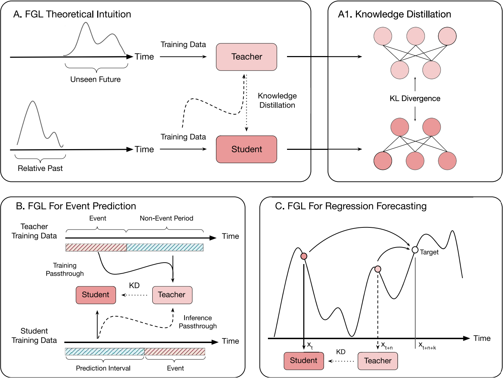

# A Predictive Approach to Enhance Time-Series Forecasting

[](https://doi.org/10.1038/s41467-025-63786-4)
[](https://www.python.org/downloads/release/python-3110/)
[](https://opensource.org/licenses/MIT)

This repository is a research study of **Future-Guided Learning (FGL)** (Nature Communications 2025, Gunasekaran et al.). FGL enhances time-series forecasting via teacher–student knowledge distillation: a **teacher** model sees near-future data, a **student** model predicts the far future, and the teacher's insight is distilled into the student by minimizing the discrepancy between their probability distributions.

This fork focuses on **three regression / nonlinear-dynamical-system domains** — Mackey-Glass, CSTR, and Lorenz-63 — and studies *when and why* FGL helps. The original EEG (AES / CHB-MIT) experiments are **not part of this study and have been removed**. The most up-to-date synthesis of the research findings is in [`conclusion/项目汇报总结.md`](conclusion/项目汇报总结.md); a condensed version is in [`conclusion/final_conclusions.md`](conclusion/final_conclusions.md).

---

## Key finding

Across the three dynamical systems FGL reliably helps, but the **size and robustness of the gain differ sharply**. Those differences *correlate* with system dynamics, yet are **not established as causal**.

**Robust, repeatable conclusions:**

* **L (lookback) and H (horizon) dominate.** Whether FGL lands in the "effective" or "failed" region is set by the (L, H) configuration; α and temperature only fine-tune *inside* an already-chosen region (the L×H span reaches ~220 pp on CSTR, vs. ~10–15 pp for an α×T grid at fixed L,H).
* **A threshold effect (MG).** When the joint information window exceeds the system's intrinsic memory / delay scale τ — `L + (H−1) > τ` — the teacher's exclusive near-future information vanishes and FGL turns negative. Verified cleanly when sweeping L at fixed H (L=9→10: baseline MSE drops 8.5×, FGL Δ flips from +78.5% to −15.7%).
* **A baseline floor (CSTR).** When the baseline is too easy (MSE collapses to a ~14.1 discretization-noise floor), the teacher's 1-step target misaligns with the student's H-step target and distillation turns harmful.
* **Teacher–student information asymmetry is the proximal mechanism.** FGL works when the teacher, via its `offset = H−1` time shift, sees near-future information the student cannot recover from its history window alone.

**Per-domain best gains** (overall best, multi-seed):

| System | Dynamics | Best FGL Δ | Positive configs | Notes |
|--------|----------|:---------:|:----------------:|-------|
| **CSTR** (H₂O) | period-1 limit cycle | **+25.7%** (L=20,H=12) | 24% (6/25) | hard to find — only +11.6% inside the coarse L×H sweep |
| **Mackey-Glass τ=13** | period-doubling | **+78.5%** (L=9,H=5) | 60% (15/25) | strongest gain |
| **Lorenz-63 ρ=60** | strong chaos | **+62.2%** (L=8,H=5) | 96% (24/25) | most robust — no tuning needed |

> **Note on the "number of feedback loops" hypothesis.** An earlier framing of this work held that FGL effectiveness *scales with the number of feedback loops* in the system (CSTR = 1, MG = 2, Lorenz = ∞). We now treat this as an **exploratory, correlational hypothesis rather than a causal conclusion**. The three systems' Δ ordering is consistent with it, but (1) there is no causal-intervention experiment, and (2) alternative explanations — predictability differences, degree of teacher–student information asymmetry — fit the same data equally well (all three systems show a positive baseline-MSE ↔ FGL-Δ correlation). It is offered as one possible reference direction, pending verification on more systems. See [`conclusion/项目汇报总结.md`](conclusion/项目汇报总结.md) §6.3 and §7.2 for the full discussion.


<details>
<summary><b>Figure 3: Overview of FGL and its applications. (Click to expand)</b></summary>
<b>A</b> In the FGL framework, a teacher model operates in the relative future of a student model that focuses on long-term forecasting. After training the teacher on its future-oriented task, both models perform inference during the student’s training phase. The probability distributions from the teacher and student are extracted, and a loss is computed based on Eq. (1). <b>A1</b> Knowledge distillation transfers information via the Kullback–Leibler (KL) divergence between class distributions. <b>C</b> In a regression forecasting scenario, the teacher and student perform short-term and long-term forecasting, respectively. The student gains insights from the teacher during training, enhancing its ability to predict further into the future.
</details>

---

## 1. Setup

Python 3.11 + `uv` (a `.venv/` lives at the repo root).

```bash
uv sync          # or: pip install -r requirements.txt
```

## 2. Domains & data

| Domain | Directory | System | Data |
|--------|-----------|--------|------|
| Mackey-Glass | `mackey_glass/` | delay-DDE chaotic (τ=13) | generated on-the-fly via `jitcdde` |
| CSTR | `cstr/` | H₂/O₂ reactor (periodic oscillation) | `cstr/generate*.py` (Cantera) → `cstr/data/` |
| Lorenz-63 | `lorenz/` | 3D ODE chaotic (ρ=60) | generated on-the-fly via `scipy.integrate` |

All three share one library — **`fgl_common/`** (RNN model, KL distillation, sliding-window discretization, the 3-stage teacher→baseline→student training loop, and an L×H sweep helper).

## 3. Running experiments

Each domain has a single `run.py` entry with an `EXPERIMENTS` on/off switch dict:

```bash
uv run python cstr/run.py --list                       # list experiments + switch state
uv run python cstr/run.py -e baseline -H 5 --alpha 0.5 # one experiment
uv run python mackey_glass/run.py -e lh_sweep          # L×H grid sweep
uv run python lorenz/run.py -e generate --sweep        # sweep ρ, generate data
```

The three-stage FGL pipeline (teacher: 1-step, offset=H-1 → baseline: H-step → student: H-step + KL distillation) is implemented once in `fgl_common.run_fgl_experiment` and reused by all domains. See [`CLAUDE.md`](CLAUDE.md) for the full API and the per-domain experiment list.

## 4. Hyperparameters

* **α (alpha)** — CE vs KL weight (0 = full distillation, 1 = baseline-equivalent).
* **T (temperature)** — softens teacher/student distributions before KL.
* **L / H** — lookback window / forecast horizon; the dominant variables for FGL effectiveness (the `L+H-1 ≥ τ` threshold holds when sweeping L at fixed H).

## 5. Citation

```
@article{Gunasekaran2025,
  author = {Gunasekaran, Skye and Kembay, Assel and Ladret, Hugo and Zhu, Rui-Jie and Perrinet, Laurent and Kavehei, Omid and Eshraghian, Jason},
  title = {A predictive approach to enhance time-series forecasting},
  journal = {Nature Communications},
  year = {2025},
  volume = {16},
  number = {8645},
  pages = {1--7},
  doi = {10.1038/s41467-025-63786-4}
}
```
