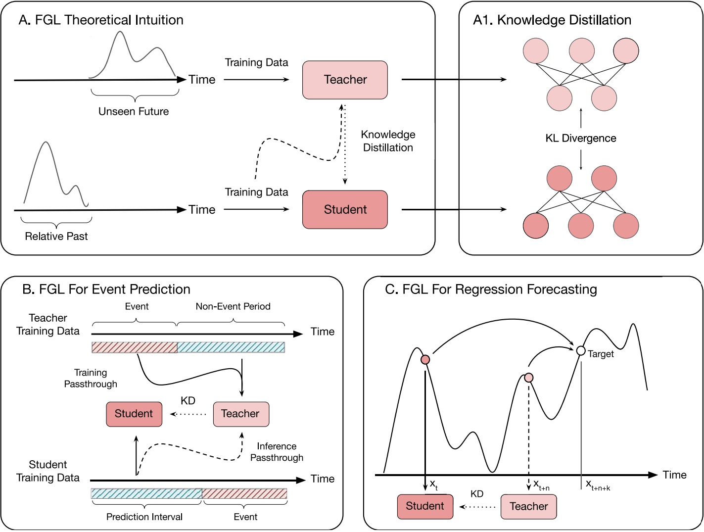

# A Predictive Approach to Enhance Time-Series Forecasting

[](https://doi.org/10.1038/s41467-025-63786-4)
[](https://www.python.org/downloads/release/python-3110/)
[](https://pytorch.org/)
[](#testing)

This repository is a research study of **Future-Guided Learning (FGL)**, based on the Nature Communications 2025 paper by Gunasekaran et al. FGL is a teacher–student forecasting framework: a **teacher** sees near-future data through a short-horizon task, while a **student** predicts farther future data. During student training, the teacher's output distribution is distilled into the student with a KL loss.

This fork studies **when and why FGL helps** on three regression / nonlinear dynamical systems:

- **Mackey–Glass** (delay DDE, τ = 13)
- **CSTR** (H₂/O₂ reactor and delayed-feedback chaotic variants)
- **Lorenz-63** (ρ = 60 strong chaos)

The original EEG experiments (AES / CHB-MIT) are outside this study's scope and have been removed.

## Latest research status: October 2026

The August reports remain the consolidated multi-system synthesis. The newest result adds a continuous direct-horizon PatchTST pathway and corrects physical-unit rescaling for continuous external baselines; see [`conclusion/conclusion_1008.md`](conclusion/conclusion_1008.md) and [`conclusion/patchtst_fgl_report.md`](conclusion/patchtst_fgl_report.md).

### 2026-10-08 continuous PatchTST update

- Added `fgl_common.patchtst_fgl.run_patchtst_fgl`: a continuous teacher→baseline→student pipeline using the same direct-horizon contract as the external baselines.
- Fixed the deep-baseline physical MSE conversion: normalized MSE is now multiplied by `y_std²` exactly once.
- On CSTR H₂O (`L=20`, 5 seeds), corrected PatchTST reaches `1.98e-3` MSE at H12 and `1.41e-3` at H15.
- PatchTST-FGL improves over the best historical RNN-FGL arm by **77.0%** (H12) and **80.1%** (H15), but does not beat the same-backbone PatchTST baseline at `α=0.5`.

The current conclusions refine the earlier "FGL helps or fails" story into a set of regime-dependent mechanisms. The latest consolidated report is [`conclusion/研究进展报告.md`](conclusion/研究进展报告.md); the most complete synthesis is [`conclusion/项目汇报总结.md`](conclusion/项目汇报总结.md). The August 21 aperiodic-CSTR and iterative-distillation findings are summarized in [`conclusion/进展0821.md`](conclusion/进展0821.md), with the convergence-speed analysis in [`conclusion/iterative_convergence_speed.md`](conclusion/iterative_convergence_speed.md).

### Established findings

1. **Lookback `L` and horizon `H` dominate.** Across systems, the `(L, H)` configuration determines whether FGL lands in an effective or harmful region. α and temperature mainly fine-tune within that region. For example, the CSTR L×H grid spans about 220 percentage points in FGL Δ, whereas α×T grids at fixed `(L, H)` change results by roughly 10–15 points.
2. **Teacher–student information asymmetry is the direct mechanism.** The teacher's `offset = H−1` gives it access to near-future information that the student cannot recover from its own history window. FGL is useful only while this exclusive information remains meaningful.
3. **Mackey–Glass threshold effect.** With fixed `H` and varying `L`, the condition `L + H − 1 ≥ τ` cleanly marks the transition. At τ = 13 and H = 5, moving from L = 9 to L = 10 drops baseline MSE by about 8.5× and flips FGL from **+78.5%** to **−15.7%**. The formula should not be treated as universally causal: on delayed chaotic CSTR, the equivalent sharp phase transition is falsified.
4. **CSTR baseline floor.** When the baseline reaches a discretization/data floor, one-shot distillation becomes harmful. Deep L×H experiments show that this floor is governed by `(L, H)`, data predictability, and whether iterative distillation is used. The multivariate floor model reaches **R² = 0.72**.
5. **Iterative/adaptive distillation is regime-dependent.**
   - Variant **E** uses a zero-floor amplified teacher−student MSE-gap weight. On standard CSTR, a 5×5 grid has 47/50 cell×seed wins over the uniform control, and the L20H15 five-seed anchor gives a +33.2% E-vs-A initial-round improvement (paired p = 0.018).
   - **E-iter** is bimodal: it can substantially accelerate or improve the floor in informative regimes, but collapses when the gap dries up or becomes noisy. Therefore **A-iter remains the safer robust default**, while E-iter is preferable in selected difficult CSTR regimes.
   - On Mackey–Glass, adaptive iterative distillation remains a negative result.
6. **Delayed-feedback chaotic CSTR is a validated stress test.** The stable delayed-feedback generator produces 13 datasets across τ ∈ [30, 150]. Their Rosenstein Lyapunov exponents are all positive, confirming genuine chaos rather than noise. Periodicity and Lyapunov exponent behave as separate dimensions.
7. **The "number of feedback loops" hypothesis is exploratory only.** The old ordering—CSTR = 1, Mackey–Glass = 2, Lorenz = ∞—is at best correlational. It lacks causal intervention, has few systems, and competing explanations such as task difficulty and information asymmetry fit the same data. Do not cite it as a causal mechanism.

### Best one-shot FGL gains

“Positive configs” counts the L×H grid cells with positive mean FGL improvement. The values below summarize the best multi-seed one-shot configurations; iterative distillation results are discussed separately above.

| System | Dynamics | Best one-shot FGL Δ | Positive configs | Notes |
|---|---|---:|---:|---|
| CSTR (H₂O, periodic) | Period-1 limit cycle | **+25.7%** (L=20, H=12) | 36% (9/25) | Low ceiling; requires careful `(L, H)` selection |
| Mackey–Glass τ=13 | Period-doubling region | **+78.5%** (L=9, H=5) | 56% (14/25) | Largest one-shot gain |
| Lorenz-63 ρ=60 | Strong chaos | **+62.2%** (L=8, H=5) | 96% (24/25) | Most robust; positive across nearly all cells |



<details>
<summary><b>Figure 3: Overview of FGL and its applications. (Click to expand)</b></summary>
<b>A</b> In the FGL framework, a teacher model operates in the relative future of a student model that focuses on long-term forecasting. After training the teacher on its future-oriented task, both models perform inference during the student’s training phase. The probability distributions from the teacher and student are extracted, and a loss is computed based on Eq. (1). <b>A1</b> Knowledge distillation transfers information via the Kullback–Leibler (KL) divergence between class distributions. <b>C</b> In a regression forecasting scenario, the teacher and student perform short-term and long-term forecasting, respectively. The student gains insights from the teacher during training, enhancing its ability to predict further into the future.
</details>

## Repository design

```text
fgl_common/          Shared library: models, data windows/discretization,
                     KL/distillation loops, continuous external baselines,
                     PatchTST-FGL, and sweep utilities
cstr/                CSTR entry point, data generators, experiments, results
mackey_glass/        Mackey–Glass entry point and jitcdde data utilities
lorenz/              Lorenz-63 entry point and experiments
conclusion/          Consolidated research reports; archive/ stores older reports
docs/                Paper/reference material and implementation design notes
tests/               Pytest suite for shared and CSTR-specific behavior
```

### Unified three-stage pipeline

`fgl_common.training.run_fgl_experiment` implements the core workflow:

1. **Teacher:** train on a one-step task with `offset = H−1`.
2. **Baseline:** train a student on the H-step task without distillation.
3. **FGL student:** train the same H-step student with KL distillation from the frozen teacher.

The teacher and student share discretization bin edges so their output distributions are comparable. `run_iterative_distillation` extends this with single/iterative arms and A/E/E-soft weighting variants; `run_baseline_converged` supports the floor-study baseline.

For the continuous external-baseline contract, `fgl_common.baselines` provides Ridge/DLinear/PatchTST/GRU/TCN. `fgl_common.patchtst_fgl.run_patchtst_fgl` reuses the PatchTST idea for a continuous teacher→baseline→student experiment: the student predicts `y[t+L+H-1]`, while the teacher sees a window shifted `H−1` steps forward and distills toward the same target.

## Setup

Python 3.11 and [`uv`](https://docs.astral.sh/uv/) are recommended.

```bash
uv sync
# or
python -m venv .venv && source .venv/bin/activate && pip install -r requirements.txt
```

Device selection follows `CUDA → MPS → CPU`. Set `FGL_DEVICE=cpu` to force CPU if an operator is unavailable on MPS. The selected device is printed as `[fgl] device = ...`.

## Domains and data

| Domain | Directory | Data source | Default benchmark |
|---|---|---|---|
| Mackey–Glass | `mackey_glass/` | Generated on the fly with `jitcdde`; τ=13 snapshot in `mackey_glass/data/` | τ = 13 |
| CSTR | `cstr/` | Cantera generators write to `cstr/data/` | Periodic H₂/O₂ data; delayed chaotic τ sweep |
| Lorenz-63 | `lorenz/` | Generated on the fly with `scipy.integrate.solve_ivp` | ρ = 60 strong chaos |

Every `data/` and `results/` directory contains an `INDEX.md` describing file provenance, experiment attribution, conditions, and reading order. Sweep outputs use `results/*.csv`, plots use `results/plots/*.png`, and logs use `results/logs/*`.

CSTR data generation requires **Cantera >= 3.2.0**. The active delayed-chaos generator is `cstr/generate_delayed_stable.py`.

## Running experiments

Each domain has one `run.py` with an `EXPERIMENTS` switch dictionary. Without `-e`, all enabled experiments run; `--list` shows their state.

```bash
uv run python cstr/run.py --list
uv run python cstr/run.py                     # baseline + L×H sweep + iterative distillation
uv run python mackey_glass/run.py --list
uv run python mackey_glass/run.py -e lh_sweep
uv run python lorenz/run.py -e generate --sweep
uv run python lorenz/run.py -e lh_sweep
```

Common parameter examples:

```bash
uv run python mackey_glass/run.py -e base --L 9 --H 5 --alpha 0.5 --temperature 4
uv run python cstr/run.py -e iterative_distill --distill_variants E,E-soft
uv run python cstr/run.py -e external_baselines --L 20 --H 15 --seeds 5
uv run python cstr/run.py -e patchtst_fgl --L_values 20 --H_values 12,15 --seeds 5
uv run python cstr/run.py -e floor_sweep --seeds 3      # disabled by default
uv run python cstr/run.py -e lyapunov                    # delayed-chaos diagnostic
```

Research analyses used in the August reports:

```bash
uv run python cstr/archive/analyze_convergence_speed.py
uv run python cstr/archive/verify_chaotic_iter_floor.py --K 10 --seeds 5
```

## Testing

```bash
uv run pytest -q
```

Current suite: **86 passed, 1 deselected** for the non-slow set. Tests cover shared iterative distillation, converged baselines, continuous external baselines and MSE rescaling, PatchTST-FGL window alignment, delayed-CSTR generation/stability, Lyapunov diagnostics, floor-sweep wiring, and result-analysis helpers.

## Hyperparameters

- **α (`alpha`)**: weight of the supervised CE loss. `α=0` is full distillation; `α=1` is baseline-equivalent.
- **T (`temperature`)**: KL softening temperature.
- **L / H**: lookback and forecast horizon—the dominant variables in this study.
- **Variant / weight floor**: `A` is uniform, `E` uses a zero-floor amplified MSE gap, and `E-soft` adds a tunable floor to reduce weight drying.

## Research documentation

| Document | Purpose |
|---|---|
| [`conclusion/conclusion_1008.md`](conclusion/conclusion_1008.md) | Latest PatchTST-FGL and corrected external-baseline summary |
| [`conclusion/研究进展报告.md`](conclusion/研究进展报告.md) | Consolidated August presentation report |
| [`conclusion/项目汇报总结.md`](conclusion/项目汇报总结.md) | Most complete three-system synthesis |
| [`conclusion/进展0821.md`](conclusion/进展0821.md) | August 21 delayed chaotic CSTR and four-arm distillation findings |
| [`conclusion/iterative_convergence_speed.md`](conclusion/iterative_convergence_speed.md) | August 9 convergence-speed and regime analysis |
| [`conclusion/floor_study_final_report.md`](conclusion/floor_study_final_report.md) | CSTR floor-determinant study |
| [`conclusion/final_conclusions.md`](conclusion/final_conclusions.md) | Earlier three-system conclusions |
| [`conclusion/archive/`](conclusion/archive/) | Superseded and historical reports |

## Next steps

The highest-priority next experiments are:

1. A controlled τ-family study that varies delay while holding periodicity fixed, converting current floor/chaos correlations into a cleaner causal comparison.
2. Additional seeds for noisy critical cells, especially long-horizon and short-horizon extremes.
3. Independent holdout evaluation to remove the current validation/test optimism.
4. Porting E/E-soft to Mackey–Glass and Lorenz, with adaptive/dynamic floor tuning.
5. Quantifying information asymmetry directly, e.g. through mutual-information or conditional-entropy contrasts.
6. Sweep weak-distillation weights (`α∈{0.9,0.95,0.99}`) and response-distribution distillation for PatchTST-FGL.

## Citation

If you use the original FGL method or this repository's code, please cite:

```bibtex
@article{Gunasekaran2025,
  author = {Gunasekaran, Skye and Kembay, Assel and Ladret, Hugo and Zhu, Rui-Jie and Perrinet, Laurent and Kavehei, Omid and Eshraghian, Jason},
  title = {A predictive approach to enhance time-series forecasting},
  journal = {Nature Communications},
  year = {2025},
  volume = {16},
  number = {8645},
  pages = {1--7},
  doi = {10.1038/s41467-025-63786-4}
}
```
