# 自适应连续蒸馏研究总结(2026-08-21)

**定位:** 汇总"自适应连续蒸馏"这条研究线的**全部内容**——单趟自适应权重变体 E、迭代(暖启动)扩展、E-soft/动态地板、以及收敛速度维度,跨 CSTR(标准 + 混沌延迟)与 MG 两域,含全部相关图片。
**一句话:** **单趟变体 E 在 CSTR 显著有效(锚点 p=0.018、网格 47/50);迭代扩展在 CSTR 上是"可靠+更快到地板"(收敛速度维度 p=0.016/3e-5)而非更低地板,在混沌 CSTR 上 regime-dependent(bimodal),在 MG 上负结果(干涸);w_floor 是浓度/稳定旋钮无免费午餐,指向动态地板。**
**关联文档:** 分报告 [`iterative_distillation_summary.md`](iterative_distillation_summary.md)(总)、[`iterative_pilot_phase0.md`](iterative_pilot_phase0.md)(CSTR Phase 0)、[`iterative_phase1_cstr.md`](iterative_phase1_cstr.md)(CSTR Phase 1)、[`iterative_pilot_phase0_mg.md`](iterative_pilot_phase0_mg.md)(MG Phase 0)、[`iterative_convergence_speed.md`](iterative_convergence_speed.md)(收敛速度维度)。

---

## 1. 概述:一条研究线,两个实现

自适应连续蒸馏的核心思想:**蒸馏权重不由超参数恒定决定,而由 teacher−student 逐样本 MSE 差距驱动**——把蒸馏预算集中到"老师对、学生错"的可教弱点上,而不是均匀撒在所有样本上。

| 实现 | 入口 | 阶段 | 状态 |
|---|---|---|---|
| **单趟变体 E** | `run_adaptive_weight`(变体 A/C/D/E) | 单趟 FGL,蒸馏时用 E 权重 | ✅ CSTR 显著(推翻旧"失败"标签) |
| **迭代(暖启动)扩展** | `run_iterative_distillation`(四臂 2×2) | 每轮重估权重 → 暖启动 → 再蒸馏 ≤K 轮 | ⚠️ CSTR 窄价值 / MG 负结果 |

**E-soft**(sigmoid 软地板)与 **w_floor** 是方法的两个旋钮,揭示"浓度 vs 稳定"的权衡,指向动态地板。

## 2. 方法

### 2.1 变体 E 权重(单趟)

`distillation.compute_weights` 以 teacher−student **逐样本 MSE 差距**为判定标准:

- **变体 E**:gap 归一化放大到 **[0, 4] 零地板**——student 已做对的点权重=0,最难点上限 4×。
- 对照:变体 A(均匀)、C(温和,权重夹在 [0.2, 2.0])、D(逐样本 α,过激失稳)。

### 2.2 迭代框架 `run_iterative_distillation`(2×2 四臂)

共享 round-0 的因子设计,归因分解"多训几轮"与"权重精修"的净效应:

|  | single(round-0 后停) | iter(round-0 后暖启 ≤K 轮) |
|--|--|--|
| **uniform (A)** | A-single = 标准 FGL | A_iter = 纯多训(权重恒均匀,**归因对照**) |
| **adaptive E** | E-single(暖启 1 轮) | **E-iter**(每轮重估 E 权重,**新方法**) |

`E_iter vs A_iter` = 迭代权重精修的**净效应**(排除"只是多训")。停止规则:val 收敛 / 退化 / K 轮兜底,keep-best-by-val。

### 2.3 E-soft / w_floor

基于"硬零地板让 E 干涸"的诊断:加 sigmoid 软地板变体 `w = 0.2 + (4−0.2)·σ((gap−中位数)/((p75−p25)/2))`,负 gap 落到软地板 0.2 而非 0,保持老师信号不断流。`w_floor` 可调(0=激进,0.2=稳定)。

### 2.4 收敛速度指标(2026-08-09 立为主指标)

从逐轮曲线 `mse_curve_test` 提取:rounds_to_floor(到共享地板 10% 内轮数)、round1_gain(首轮进步)、auc_norm(归一化曲线下面积)、floor(各臂 min,仅作口径参照)。

### 2.5 框架集成(2026-07-31)

`run_iterative_distillation` 重构为**双权重分布 × 单/迭代臂**:一次调用同时训练硬(E)与稍软化(E-soft),6 臂(A_single/A_iter 对照 + E/E-soft × single/iter)。`cstr/run.py` 的 `iterative_distill` 实验**默认启用**,CLI `--distill_variants`/`--w_floor` 可切换,CSV 落盘;MG 保持关闭(负结果)。

## 3. 单趟变体 E:CSTR 验证(核心正向结果)

**推翻旧"adaptive_weight 失败"标签。** 旧标签源于 baseline-CE-gap + 索引错位 + 温和归一化三重缺陷;改为 teacher−student MSE gap + 零地板放大后显著起效。

### 3.1 锚点 L20H15(n=5,已补档验证)

`cstr/results/adaptive_anchor_L20H15_n5.csv`:

| 变体 | Δinit(相对 init student) | 备注 |
|---|---:|---|
| A(均匀) | +6.2%±13.6 | 噪声底 |
| C(温和) | +10.6%±21.5 | 落在噪声里 |
| **E(零地板放大)** | **+33.2%±22.0,5/5 seed 全正** | 配对 E−A 均值 +27.0pp,**t≈3.86,p≈0.018** |

final student MSE 从 ~98.6 降到 ~68.8(−30%);FGL vs baseline 增益从 +23% 翻到 +46%(A 为 +23.2%)。

### 3.2 L×H 网格(5×5 × 2 seeds)

`cstr/results/adaptive_lh_sweep.csv`:**25/25 cell 均值为正,E<A 在 47/50 paired seed,平均降 30.4%**。中部(标准 student 还弱、MSE 100–140)增益 +25~67%;L=72 整行(A 已逼近地板 MSE≈14)仅 +1~9%。

### 3.3 机制:弱点高度集中

诊断显示 student 的弱点**极集中**:top-10% 点占 99.6% 总 gap,**82% 的点 student 已和 teacher 一样好**;在 student 最差点上 teacher MSE≈1.4(老师对、学生错,**可教**)。E 把全部蒸馏预算集中到弱点、不再浪费在已解决的点上 → 起效。

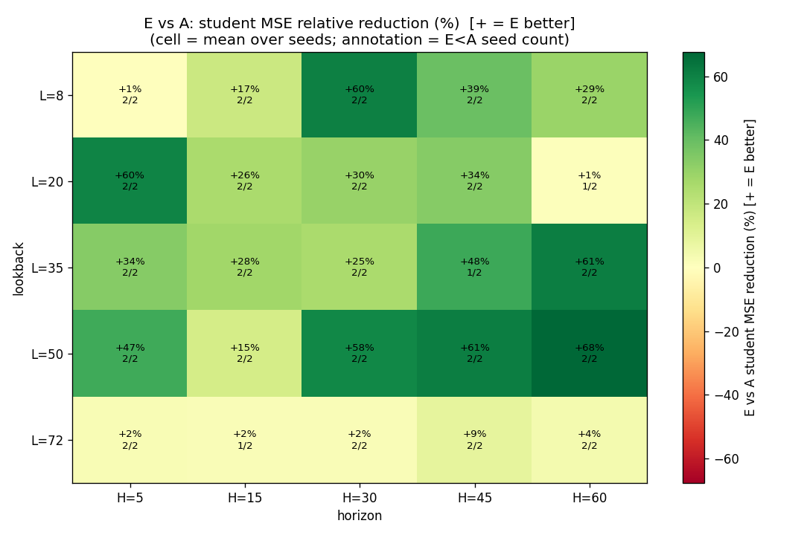

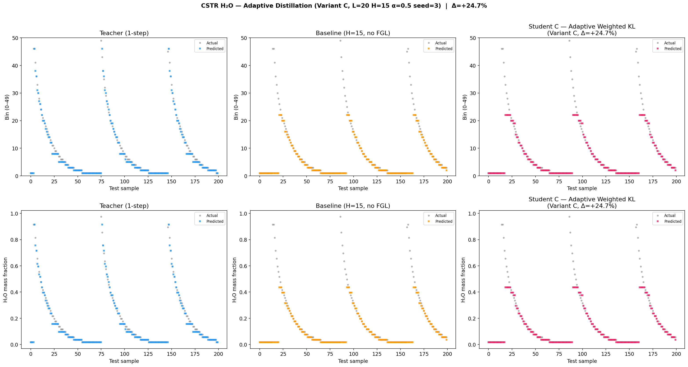

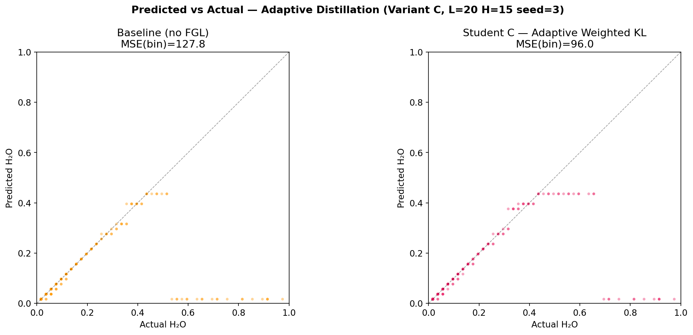

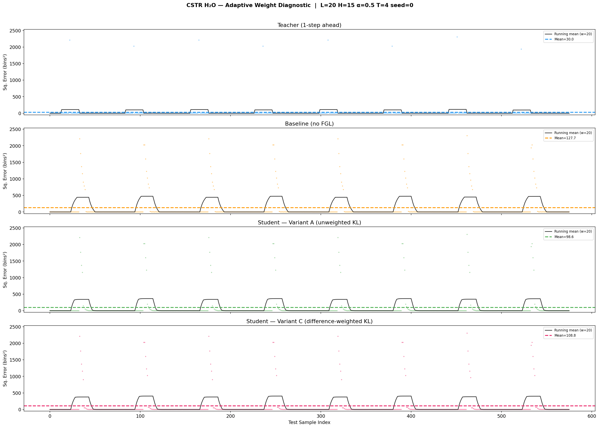

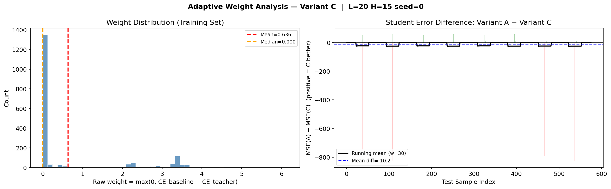

> 注意:E 仅 CSTR 验证,MG/Lorenz 未移植;W_MAX=4/零地板未调参,可能更好。

## 4. 迭代蒸馏 CSTR:从乐观到收紧

### 4.1 Phase 0(3 典型点 × 3 seeds,K=3)——概念成立

| 典型点 | L | H | E_iter | A_iter | E_iter vs A_iter |
|---|---|---|---|---:|---:|
| P1 锚点·中增益 | 20 | 15 | **48.2** | 71.0 | **−30.8%** |
| P2 高增益·大空间 | 8 | 30 | **62.4** | 103.8 | **−35.1%** |
| P3 地板·天花板 | 72 | 15 | 14.1 | 14.1 | 0.0%(地板处加权无效) |

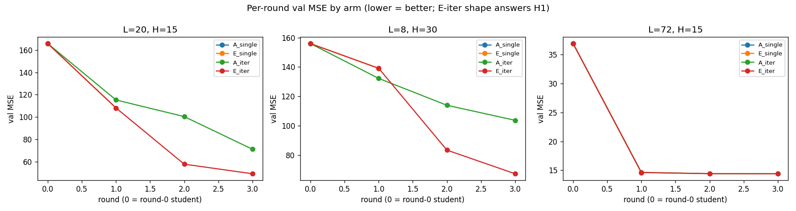

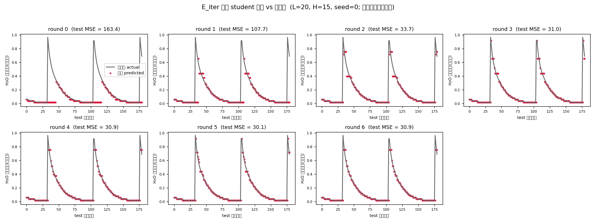

### 4.2 饱和分析(K=15)——口径修正

**E_iter 优势是"可靠 + 更快到达地板",不是"更低地板"。** 当 A_iter 真正收敛时,它达到与 E_iter 相同的地板(~30,降 82%);E_iter 的真正价值是 **L20H15 三 seed 全到 30**,而 A_iter 三 seed 中两个卡在 57(均匀训练 plateau 停滞)。

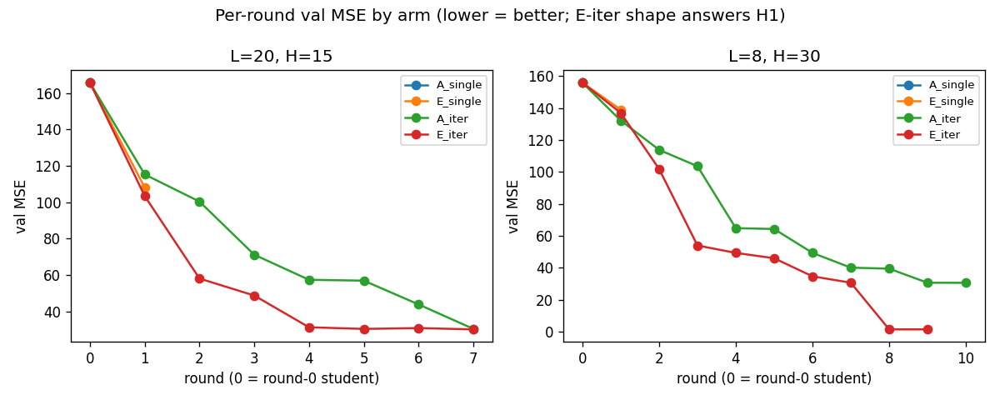

> ⚠️ L8H30 seed1 的 test MSE=1.4 是周期系统 val≈test 下 keep-best 过拟合的离群,非可复现饱和值;鲁棒饱和值取 ~32。

### 4.3 Phase 1(锚点 n=10 + 5×5×2,K=6)——正式收紧

- **锚点 L20H15(n=10)**:E_iter vs A_iter **配对 t p=0.94、Wilcoxon p=0.70,无显著差异**。Phase 0 的 +31% 是 K=3 早期速度快照。
- **网格 5×5 × 2**:E<A 26/50(52%),均值 +6.6% 但**中位数 0.0%**,配对 t p=0.005——**名义显著但由离群 + A_iter 卡死驱动,不稳健**。
- **唯一站得住的窄事实**:中等难度 cell(L8-35、H30-60)上 E_iter 比 A_iter **更不容易卡死**(A_iter 偶停 56-95,E_iter 收敛到 44-67)——是**可靠性,不是更低地板**。

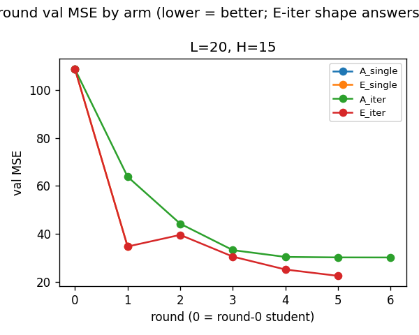



## 5. 迭代蒸馏 MG:负结果(不跨域泛化)

MG τ=13(倍周期分岔,FGL 本就强 +59~78%)上 E_iter 的净效应为负/零:

| 点 | L+H−1 | A_iter | E_iter | E_iter vs A_iter |
|---|---|---:|---:|---:|
| M1 | 10(<τ) | 0.74 | **0.92** | **−24%(更差)**,且 1/3 seed 不收敛(5.06) |
| M2 | 13(=τ) | 0.60 | **0.52** | +13%(略好) |
| M3 | 19(>τ) | 0.28 | 0.29 | ≈ |

**与 CSTR 相反**:CSTR 上 E_iter 是"更可靠"的,MG 上 E_iter 反而**更不可靠**。迭代本身(E_iter > E_single)仍成立,但主要是"多训练"贡献(A_iter 同样大幅改善)。**方法不跨域泛化。**

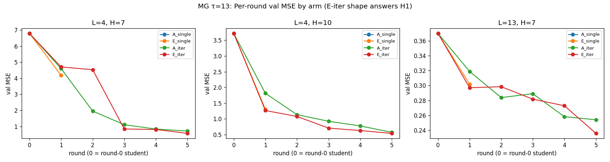

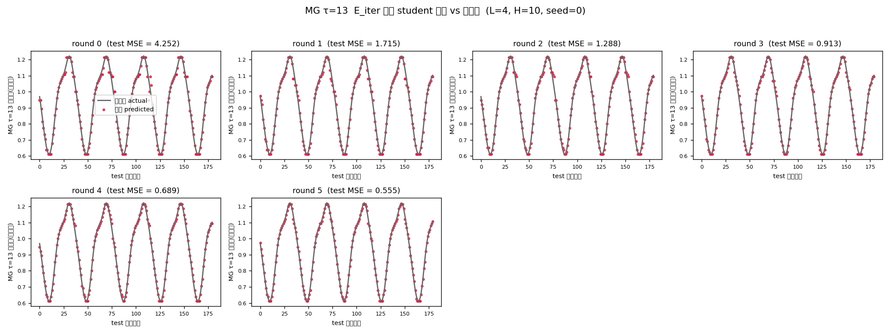

## 6. E-soft / w_floor 扫描:浓度 vs 稳定的无免费午餐

基于"硬零地板让 E 干涸"诊断(MG 的 M1 崩溃是干涸所致),加软地板变体后:

### 6.1 MG w_floor 扫描(3 点 × 3 seeds,E_iter per-seed-min 中位数)

| 点 | A_iter | E(wf=0) | wf=0.05 | wf=0.1 | wf=0.15 | wf=0.2 |
|---|---:|---:|---:|---:|---:|---:|
| M1 L4H7 | 0.74 | 0.92 ⟂[.57,**5.06**] | 0.77 [.58,.93] | 0.75 | 0.75 | 0.75 |
| M2 L4H10 | 0.60 | **0.52** | 0.60 | 0.67 | 0.65 | 0.66 |
| M3 L13H7 | 0.28 | 0.29 | 0.30 | 0.30 | 0.30 | 0.30 |

- **M1 崩溃修复**:任何非零地板(wf≥0.05)都修好——5.06 → <0.93,三 seed 全收敛(机制诊断证实)。
- **M2 浓度稀释**:任何非零地板都稀释——E(wf=0)0.52 最好,软地板全输。
- **直接冲突,无甜点**。`w_floor` 是**浓度/稳定旋钮**。

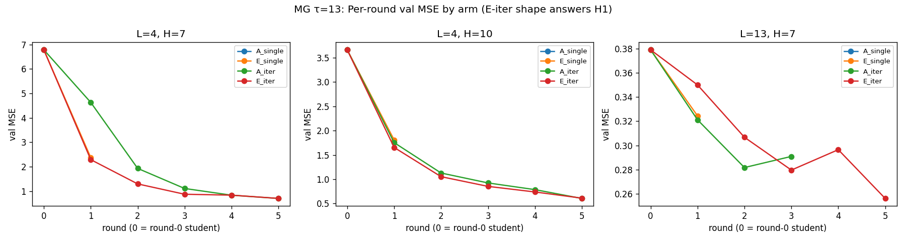

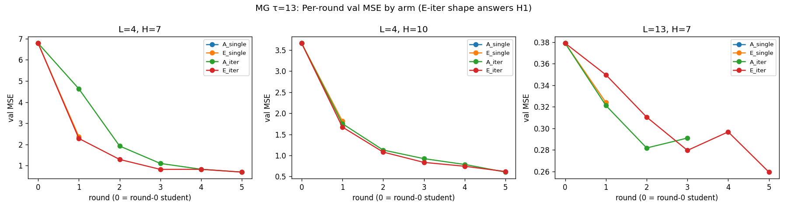

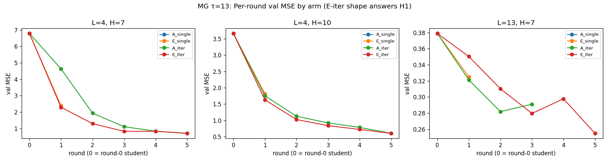

### 6.2 CSTR E-soft(wf=0.2,3 点 × 3 seeds)

| 点 | A_iter | E-soft | E-soft vs A |
|---|---:|---:|---:|
| L20H15 锚点 | 30.0 | 29.9 | +0.4%(中性) |
| L8H30 中难度 | 30.4 | 34.6 | **−13.8%(更差)** |
| L72H15 地板 | 14.1 | 14.1 | ≈ |

**中难度 cell 反而更差**——软地板稀释了 E 在这里的可靠性优势。E-soft 也没修好 CSTR 的 per-seed stall(那是训练动态卡死,非干涸)。

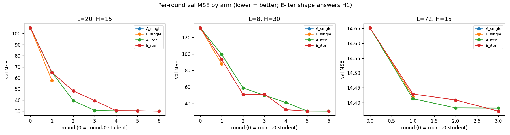

### 6.3 结论

**MG 的"干涸崩溃"(易任务)与 CSTR/M2 的"浓度优势"(有空间)是零地板机制的两面,静态地板无法兼得** → 暗示真正解法是**动态地板**(早期硬地板保浓度、后期软地板防干涸)。

## 7. 收敛速度维度(2026-08-09,被弱化维度的补刀)

此前所有报告只量化"地板高度",从未把"到达地板的速度"立为主指标——这埋掉了 E 的速度优势。本轮补上。

### 7.1 标准 CSTR:E 稳健更快,地板持平(与旧结论不冲突)

| 数据集(配对差 E−A) | rounds_to_floor Δ [95%CI] | p | round1_gain Δ | floor Δ | rounds 中位 A→E | 速度胜 E/A |
|---|---|---|---|---|---|---|
| **anchor L20H15 (n=10)** | **−1.43 [−1.92, −0.93]** | **0.016** | +0.27,p=0.002 | −0.34(NS) | 2.5→1.0 | **7/0** |
| **grid (50 配对)** | **−0.78 [−1.15, −0.41]** | **3e-5** | +0.13,p=3e-5 | −3.9(NS) | 1→1 | **16/0** |
| saturation (K=15) | median **7→4** | — | ≈ | −17.3(NS) | 7→4 | 2/0 |

**首轮进步 E=+67.8% vs A=+40.9%(~1.7×)**。旧结论"E≈A"在**地板高度**上成立,但**速度**上 E 明显更快——"用一半轮数到同一地板"。⚠️ E 曲线退化率 anchor 9/10、grid 33/50(重估反噬频繁,但早期红利盖过它)。

### 7.2 混沌 CSTR(K=10 饱和核实,`chaotic_floor_verify.csv`,4 cell × 5 seed)

| cell | A 地板 | E 地板 | E−A [95%CI] | E 赢 | E 崩¹ | 判定 |
|---|---|---|---:|---:|---|---|---|
| **L85H15** | 119.7±2.2 | **87.0±21.2** | **−32.7 [−58.6, −6.8]** | 4/5 | 0/5 | ✅ **E 真赢(CI 排除 0)** |
| L50H15 | 118.1±1.3 | 100.5±33.7 | −17.6 [−59.3, +24.0] | 3/5 | 0/5 | ⚠️ E 赢但不稳(sd 33.7) |
| L20H15(锚点) | 145.3±1.2 | 145.6±10.2 | +0.3 [−13.6, +14.1] | 3/5 | 0/5 | ≈ 持平 |
| **L100H30** | 89.5±6.2 | 156.4±15.3 | **+66.8 [+49.0, +84.6]** | 0/5 | **5/5** | ❌ **E 灾难性崩** |

¹ E 崩 = E > A×1.3(早停在坏盆底)。
**L85H15 的地板优势是真实的,不是 K=5 假象**(K=10 饱和后仍 −27%、CI 排除 0、4/5 seed)。**旧"E≈A on delayed CSTR"只看 L20H15 锚点是特例**;摊到网格是 regime-dependent。L100H30 的 E 崩机制:E `201→170→176`,第 2 轮上行 → 触发 degradation-stop → 锁死 ~155;A 用满 10 轮磨到 89。混沌 CSTR 上 E 曲线退化率 19/20(pooled)。

### 7.3 MG:速度优势消失;机制 = 底层收敛太快饿死 E

rounds_to_floor 中位 A=4 **E=5**(E 反而略慢,NS);round1_gain NS;floor A 略低 5/9。

| | round-1 进步 A | round-1 进步 E | **E/A 进步比** | E 曲线退化率 |
|---|---|---|---:|---|
| 标准 CSTR anchor | +40.9% | +67.8% | **1.70** | 9/10 |
| MG sweep | +32.2% | +37.6% | **1.27** | 5/9 |

**答:有关,但不是"E 收敛慢",而是"底层任务收敛太快,把 E 的加机制搞坏"。** MG 是易任务 → student 收敛极快 → teacher−student gap 第 2–3 轮塌掉 → E 的 gap 驱动权重在大部本上归零(蒸馏池"干涸")→ 重估出噪声权重 → E 退化早停。

## 8. 统一机制图景:E 的自适应重估是 bimodal

| regime | gap 状态 | E 重估结果 | E 表现 |
|---|---|---|---|
| 中 L / H15(CSTR L85、混沌 CSTR L50/85) | informative | 浓缩到难点、放大教师信号 | ✅ 大赢(−27% 地板) |
| 锚点 / 易任务(MG M1、CSTR L20H15) | 干涸或 ≈0 | 权重归零、E≈CE-only | ≈ 持平 / 略输 |
| 最难 cell(CSTR L100H30) | 太噪 | 重估出坏权重、首轮上行 | ❌ 退化早停、锁死坏盆底 |

**E 的自适应重估要么大赢、要么大输,取决于 gap 是否 informative;A 的均匀权重是稳健主力。** 这解释了为何 E 的方差总是远大于 A(L50H15:E sd 33.7 vs A 1.7)——bimodal 分布。

## 9. 对旧结论的修正轨迹

| 旧口径 | 现状 |
|---|---|
| "adaptive_weight 失败"(baseline-CE-gap) | ❌ 推翻——改 teacher−student MSE gap + 零地板放大后,变体 E 在 CSTR 显著(§3) |
| "E_iter ≈ A_iter(p=0.94)"(2026-07) | ⚠️ 仅**地板高度**口径成立;**速度**上标准 CSTR E 稳健更快(p=0.016/3e-5,§7.1) |
| "E≈A on delayed CSTR"(基于 L20H15 锚) | ⚠️ 锚点特例;网格上 regime-dependent——中 L/H15 E 真赢(L85 −27%),最难 cell 崩(L100H30,§7.2) |
| "E 优势是可靠+更快,非更低地板" | ✅ 标准 CSTR 上速度侧证实并量化;混沌 CSTR 上连地板都赢(中 L/H15),代价是 bimodal 不稳 |
| "MG 负结果 = 不跨域" | ✅ 补充机制量化:E/A 首轮进步比 1.70→1.27,底层收敛太快饿死 E(§7.3) |

## 10. 数据与复现

### 关键数据
| 内容 | 文件 |
|---|---|
| 单趟 E 锚点(n=5) | `cstr/results/adaptive_anchor_L20H15_n5.csv` |
| 单趟 E L×H 网格 | `cstr/results/adaptive_lh_sweep.csv`、`cstr/results/adaptive_weight_results.csv` |
| CSTR 迭代 Phase 1 | `cstr/results/iterative_phase1_anchor.csv`、`iterative_phase1_grid.csv` |
| CSTR 饱和(K=15) | `cstr/results/iterative_saturation_sweep.csv` |
| CSTR E-soft | `cstr/results/iterative_sweep_E-soft_wf0.2.csv`、`iterative_sweep.csv` |
| CSTR 混沌核实(K=10) | `cstr/results/chaotic_floor_verify.csv`(4 cell × 5 seed × 2 arm) |
| 混沌 CSTR 迭代 | `cstr/results/iterative_delayed_summary.csv`、`iterative_distill.csv` |
| MG 迭代 + E-soft | `mackey_glass/results/iterative_mg_sweep.csv`、`iterative_mg_sweep_E-soft*.csv` |

### 复现命令
```bash
uv run python cstr/run.py -e iterative_distill --distill_variants E,E-soft   # E-iter 双权重分布(默认开)
uv run python cstr/run.py -e adaptive_weight --variants A,C,E                  # 单趟变体 E
uv run python cstr/run.py -e adaptive_grid                                     # 单趟 E vs A L×H 网格
uv run python cstr/archive/analyze_convergence_speed.py                        # 收敛速度分析(跨域)
uv run python cstr/archive/verify_chaotic_iter_floor.py --K 10 --seeds 5       # 混沌 K=10 饱和核实(~47 min @ MPS)
```

### 实现位置
`fgl_common/training.py::run_iterative_distillation`(+ `_iterate_student`/`_compute_arm_weights`/`_should_stop`)、`run_adaptive_weight`;`fgl_common/distillation.py::compute_weights`(变体 A/B/C/D/E/**E-soft**,`w_floor` 可调)。测试:`tests/fgl_common/test_iterative_distillation.py`(17 用例)。设计:`docs/superpowers/{specs,plans}/2026-07-28-iterative-adaptive-distillation*.md`、`2026-07-31-iterative-distillation-framework-integration*.md`。

## 11. 开放问题 / 下一步

1. **动态地板**(机制驱动的首选,最高优先):地板硬度随训练进度从 0→0.2 渐变——早期学生弱、有空间,用硬地板保浓度;后期接近收敛、易干涸,切软地板防崩溃。收敛速度研究 §8 又给它一个动机:**救 L100H30 这类 E 崩**(最难 cell 的"太噪" gap)。
2. **独立 holdout 复核**:val≈test 下 keep-best 等同挑 test 最优,网格 p=0.005 需剔除过拟合离群后复核。
3. **变体 E 移植 MG/Lorenz**:验证 E/E-soft 普适性;调 W_MAX/地板。Lorenz(强混沌、baseline 不触地板)未测,是第三域。
4. **量化信息不对称指标**(互信息差/条件熵差)。
5. **诊断 gap 分布**:对比 CSTR/MG 的 teacher−student MSE gap 稳定性,直接验证"MG 的 gap 逐轮漂移更剧烈"假说。
6. 混沌 CSTR 核实 **n=5 偏小**,加 seeds 更稳(L85 的 CI 下沿 −6.8 不宽)。
