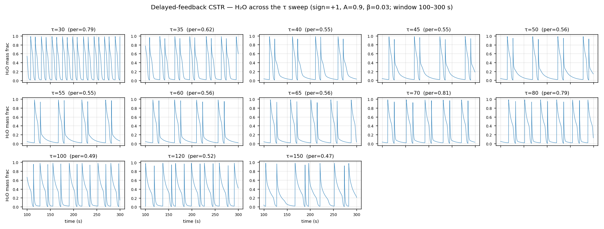
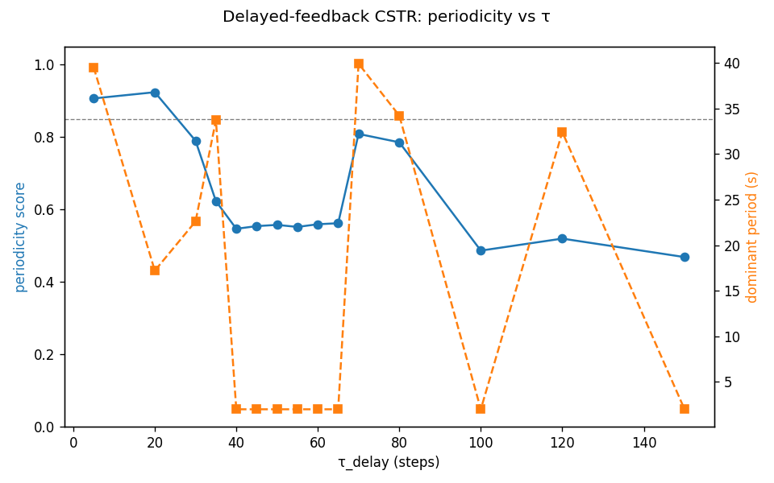
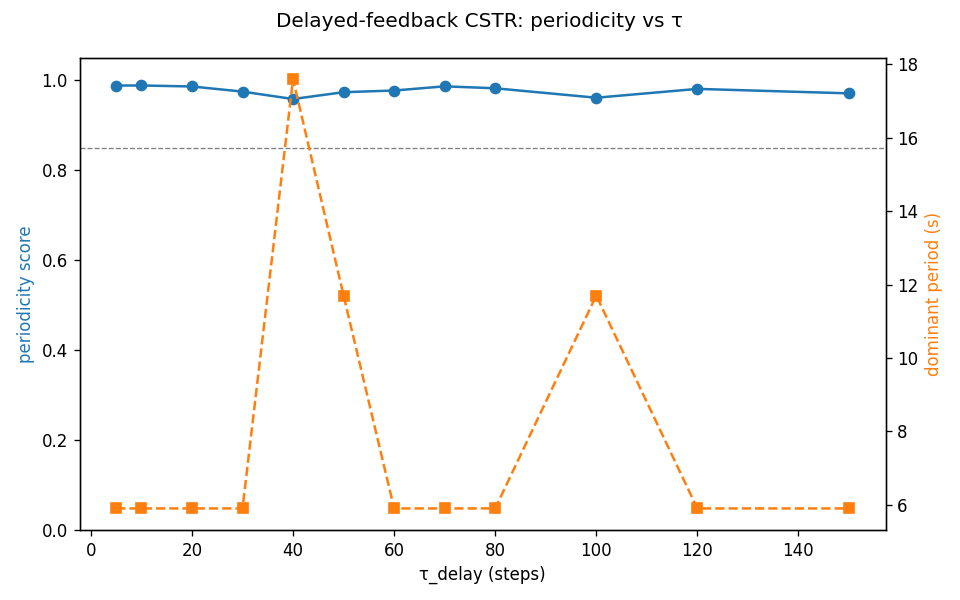
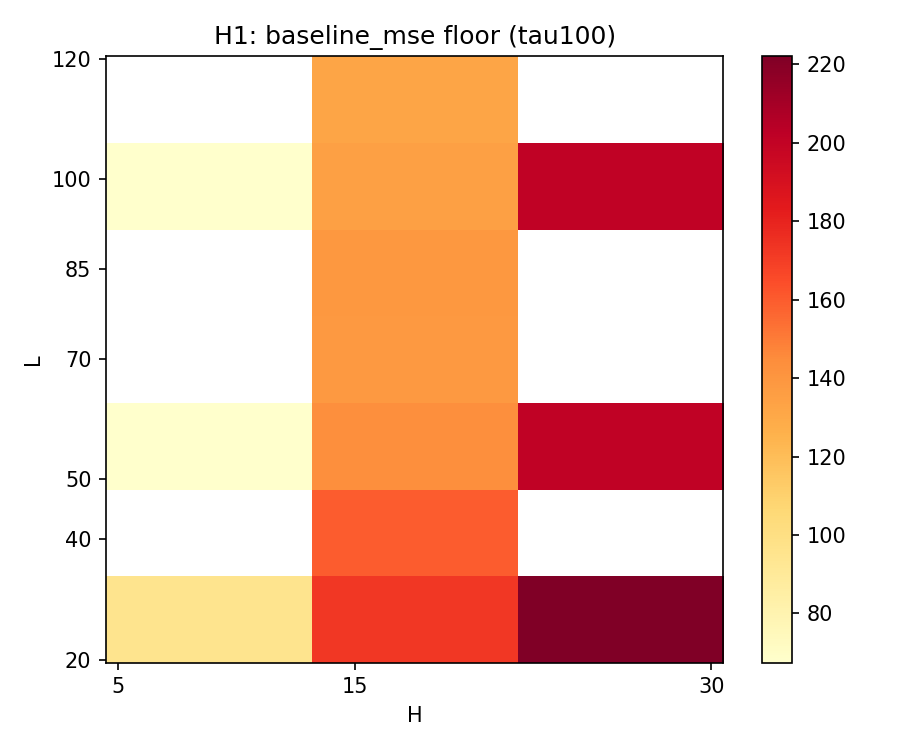
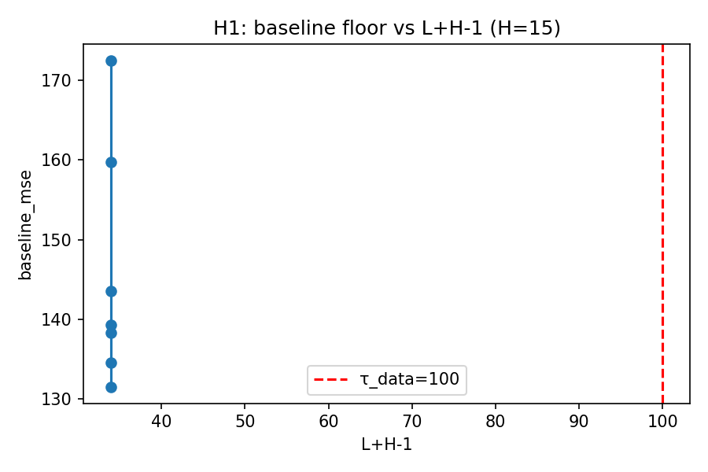
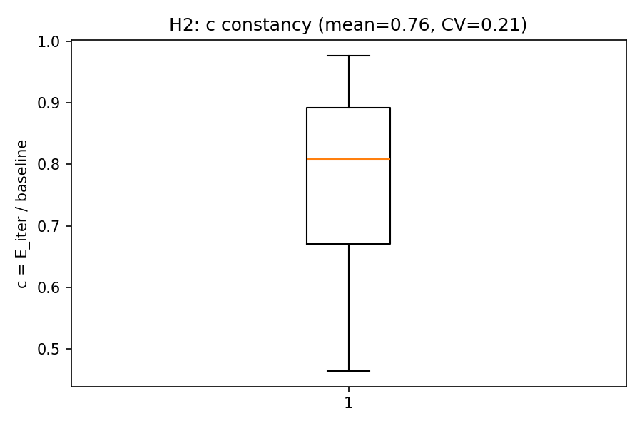
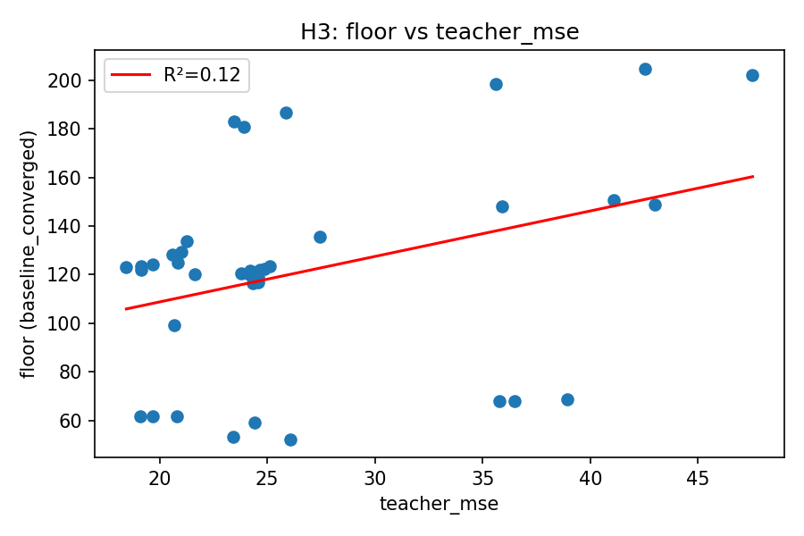
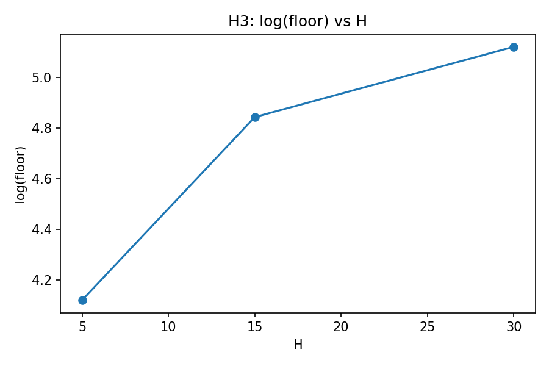
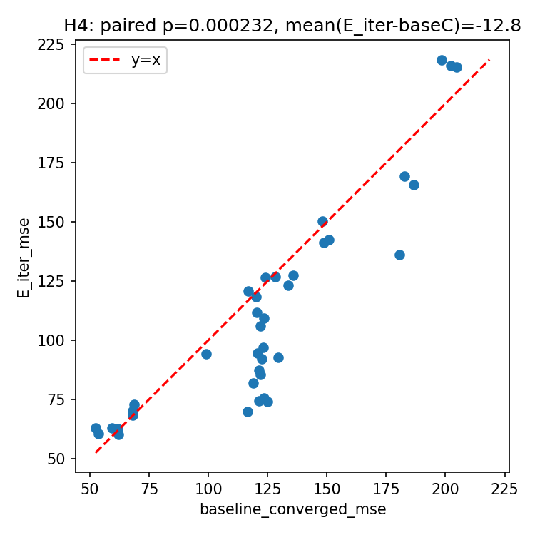

# CSTR 非周期数据集生成报告

**日期:** 2026-08-21
**范围:** 延迟反馈混沌化 CSTR 的生成方法、三项稳定性增强措施、非周期数据集现状、以及稳定性方法对结果的影响评估。
**定位:** 聚焦"数据是怎么来的"——生成器机制 + 数据集清单 + 方法对结论的效应。FGL 在混沌 CSTR 上的下游结论见 [`chaotic_cstr_fgl_exploration.md`](chaotic_cstr_fgl_exploration.md) 与 [`研究进展报告.md`](研究进展报告.md) §3.1。
**配套代码:** `cstr/generate_delayed_stable.py`(活跃生成器);`tests/cstr/test_delayed_stable.py`(14 个单元测试)。
**数据:** 13 个非周期数据集在 `cstr/data/`;过渡曲线/面板图在 `cstr/results/`。

---

## 1. 背景与动机

CSTR(H₂/O₂,单 IdealGasReactor)是刚性弛豫振荡器,呈干净的**周期-1 极限环**(periodicity ≈ 0.95,自然周期 ≈ 7.15 s)。项目主线发现这种强周期性正是 FGL"地板效应"的温床。一个自然问题:**能否把 CSTR 混沌化?若能,FGL 增益是否回升?**

**结论(Phase A 前期):基础 CSTR 无法用单一物理参数调出混沌。**

| 生成器 | 可调参数 | 结果 |
|---|---|---|
| 基础 `generate.py` | U / K / flow | periodicity 0.93–0.98,最低 0.9348 |
| `generate_delayed_feedback.py` | τ(5–120)、A(0.1–0.5) | **所有 τ/A 全崩**(CVODES 发散) |
| `generate_dual_cstr.py` | volume_B(@回收 0.3) | periodicity 1.0000(锁相) |
| `generate_forced.py` | 幅值×频率 | periodicity 1.0000(锁相) |

固定入口单 CSTR 是有限维 ODE 的稳健极限环;**延迟反馈(DDE)是理论唯一保证混沌的路线**。原延迟反馈脚本虽崩溃,但方向正确。

## 2. 生成方法:延迟反馈 DDE 路线

### 2.1 物理拓扑(保留原 `generate_delayed_feedback.py`,用户锁定)

- **反应器:** 单 `IdealGasReactor`,H₂/O₂(h2o2.yaml),T/P/组分/体积/阀门/散热参数同 `generate.py`。
- **传感器:** H₂O 质量分数 `cstr.thermo.Y[h2o_idx]`。
- **延迟线:** `deque(maxlen=τ_delay)`;延迟样本 = `buffer[0]` = H₂O((t−τ)·dt)。
- **执行器:** 入口 `MassFlowController` **mdot**(不变,非温度、非组分)。
- 锁定约束:*"保留 mdot 反馈拓扑,控制律可调"*。

### 2.2 控制律(唯一的改动)

```
mdot(t) = mdot₀ · (1 + s · A_eff(t) · tanh((H₂O[t−τ] − c) / w))
```

| 符号 | 含义 | 默认 | CLI |
|---|---|---|---|
| `s` | 反馈符号(+1/−1) | −1 | `--sign` |
| `A` | 反馈幅值 | 0.3 | `--amplitude` |
| `c` | 中心(H₂O 中点) | 0.48 | `--center` |
| `w` | 饱和宽度 | 0.1 | `--width` |
| `t_onset` | 缓启动时长(s) | 50 | `--onset` |

## 3. 崩溃根因与三项稳定性增强

### 3.1 原生成器为何全崩

原律 `mdot = mdot₀·(1 + A·(H₂O[t−τ]/0.96 − 0.5))` 是**正反馈 × 无界 × 硬接通**。点火尖峰处,正反馈把尖峰放大成热失控,CVODES 触达 `hmin`。τ=50 时崩于 t≈4.9s(≈第 49 步,恰是延迟线首次填满、反馈接通的时刻)。**降 A 无效(A=0.1 反而更早崩)——是结构性问题,不是幅值问题。**

### 3.2 三项修复(缺一不可)

| # | 增强 | 机制 | 作用 |
|---|---|---|---|
| 1 | **有界 tanh 控制律** | tanh 把反馈项夹在 [−A, +A],保证 `mdot ∈ [mdot₀(1−A), mdot₀(1+A)]` | 根除发散;小信号极限(\|H₂O−c\|≪w)退化为原线性律 → **原律的有界版本,非新结构** |
| 2 | **缓启动 onset** | `A_eff(t) = A·min(1, t/50s)` 从 0 线性升 | 消除第 τ 步硬接通;onset=50s ≫ max τ(15s),延迟线先满、两个瞬态不碰撞 |
| 3 | **EMA 低通滤波 β=0.03** | `dh_smooth = β·H₂O[t−τ] + (1−β)·dh_smooth` | **关键修复**:H₂O 点火尖峰化让 mdot 与尖峰同步剧烈摆动,把点火锐化到 CVODES 容忍度外;滤波把感知信号抹平(β=1 可禁用)。滤波是**控制器带宽**,非 plant 改动 |

> 修复过程走 TDD:smoke test 在 t=22s 仍抓到崩溃 → 定位到尖峰摆动 → 加滤波才解决。14 个单元测试验证了有界性、符号单调性、onset 斜坡、periodicity 度量、sweep 编排。

## 4. 参数空间结论:只有正反馈强反馈出过渡

扫描 (sign, A, β):

- **负反馈(s=−1)/弱反馈 → 锁相**:periodicity 0.96–0.99,全 τ 无过渡 → 负反馈路线证伪。
- **正反馈 s=+1, A=0.9, β=0.03 → 清晰过渡**(全稳定,0 崩)。此配置即 13 个数据集与过渡曲线的来源。

## 5. 非周期数据集现状

### 5.1 过渡曲线(`cstr/results/delayed_tau_sweep_s1_A0.9_b0.03.csv`)

| τ(steps) | 5 | 20 | 30 | 35 | 40–65 | 70 | 80 | 100 | 120 | 150 |
|---|---|---|---|---|---|---|---|---|---|---|
| periodicity | 0.91 | 0.92 | 0.79 | 0.62 | **0.55** | 0.81 | 0.79 | 0.49 | 0.52 | 0.47 |
| 主周期(s) | 39.5 | 17.2 | 22.6 | 33.7 | 2.0(指标地板) | 39.9 | 34.2 | 2.0 | 32.4 | 2.0 |

周期(τ5/20)→ **非周期带(τ35–65,per≈0.55)** → 准周期恢复窗(τ70–80)→ 再非周期(τ100–150),典型 DDE 分岔的交替带。**证实了"中间 τ 出现周期↔非周期过渡"的假设。** τ=10 在 sweep 中失败(`CanteraError`),无数据集。保存阈值为 periodicity<0.85 → **13 个数据集**(6000 点、2 列 float64 tensor,与其它生成器同格式):

```
cstr/data/data_delayed_stable_h2o_tau{30,35,40,45,50,55,60,65,70,80,100,120,150}_s1_A0.9_b0.03.pkl
```

### 5.2 真混沌确认:Lyapunov 全正(`cstr/results/lyapunov_tau.csv`)

Rosenstein 最大 Lyapunov 指数,13 数据集 **λ∈[0.0018, 0.0108]/样本 全为正** → **真混沌,非数值噪声/伪混沌**。且 λ 与 periodicity **不单调**(τ=30 λ最大但 per=0.79;τ=50 λ最小但 per 低)→ "周期性"与"混沌度"是**两个独立维度**,不应混用。

## 6. 稳定性方法对结果的影响评估

**总判断:会,但三方法影响程度差异极大,且都不破坏结论有效性。**

| 方法 | 对结果的影响 | 判断 |
|---|---|---|
| **缓启动 onset** | 只调制 t<50s 瞬态;periodicity 度量、FGL 训练、Lyapunov 估计全部在 burn-in(100s)后的稳态段上 | ✅ **零影响**,可完全排除 |
| **有界 tanh** | 只改变大摆幅时的饱和形状;正常摆幅内逼近原线性律;本质是真实执行器(有限 mdot)的物理现实 | ✅ 影响很小,且方向更贴近物理 |
| **EMA 滤波 β=0.03** | 在反馈回路引入低通/相位滞后;**时间常数 τ_f≈dt/β≈3.3s≈33 步,与自然周期(7.15s)和 τ(30–150 步)同量级**——实质性改变闭环动力学:移动分岔临界点、抑制高频、可能轻微抬高 periodicity score | ⚠️ **影响最大,需诚实标注** |

**关键澄清:**
1. **稳定性不是靠削弱反馈强度换来的**——过渡曲线在 **A=0.9 强反馈**下才出现,且 λ 全正。若靠降 A 求稳定,只会更早崩(A=0.1)或锁相。
2. 滤波作用在**延迟后的信号**上,是控制器的一部分("Filter is part of the controller, not the plant")。研究问题本就是"延迟反馈下的闭环 CSTR 动力学",控制器是系统组成——**滤波是系统定义的一部分,不是污染**。
3. 所有基于这 13 个数据集的结论(Lyapunov 全正、混沌 floor、E_iter regime、收敛速度)严格说属于**"带物理控制器动态(饱和+滤波)的延迟反馈 CSTR"**,而非裸 DDE。这比理想 DDE 更接近真实执行器物理,不是缺陷。
4. **外推 caveat**:滤波对 periodicity 和 λ 都有单向的"平滑/抑制高频"效应;方案 C(固定 periodicity 变 τ 去混杂实验)的趋势结论稳健,但**绝对值/临界 τ 会带滤波器偏差**。
5. 保存的数据集只含 H₂O 物理量(不含控制信号),FGL 结论不受稳定性方法的直接混淆路径影响。

## 7. 图片索引

### 7.1 数据集面板图(非平衡状态本身的可视化)

13 个非周期数据集的 H₂O 质量分数时间序列小多重图(按 τ 排列,每格标注 periodicity score),直观呈现周期→非周期过渡。



### 7.2 过渡曲线(当前活跃配置)

正反馈 s=+1, A=0.9, β=0.03 的 periodicity-vs-τ 过渡曲线,副轴叠加主周期。即 13 个数据集的来源扫描图。



### 7.3 负反馈对照(被证伪路线的对比)

负反馈/弱反馈的对照扫描——锁相(periodicity 0.96–0.99)、全 τ 无过渡。用于论证"为什么只有正反馈强反馈路线成立"。



### 7.4 相关下游分析图(τ=100 混沌数据集上的地板战役)

以下为 τ=100 混沌延迟 CSTR 上的 FGL 地板成因分析图(H1–H4),属于生成数据的**下游使用**,非生成本身:








## 8. 复现命令与数据索引

### 复现
```bash
# 生成过渡曲线 + 13 个非周期数据集
uv run python cstr/generate_delayed_stable.py --sweep --sign 1 --amplitude 0.9 --filter_beta 0.03 --fine_around 50

# 重新绘制数据集面板图(注意:脚本需在 cstr/ 根目录运行,当前位于 archive/)
uv run python cstr/archive/plot_delayed_stable.py   # 需先修正其中的相对路径

# Lyapunov 估计
uv run python cstr/run.py -e lyapunov

# 生成器单元测试
uv run pytest tests/cstr/test_delayed_stable.py -v
```

### 数据/产物索引
| 类型 | 路径 |
|---|---|
| 生成器 | `cstr/generate_delayed_stable.py`;对照(崩溃原版)`cstr/generate_delayed_feedback.py` |
| 单元测试 | `tests/cstr/test_delayed_stable.py`(14 个) |
| 数据集 | `cstr/data/data_delayed_stable_h2o_tau*_s1_A0.9_b0.03.pkl`(13 个) |
| 过渡曲线 CSV | `cstr/results/delayed_tau_sweep_s1_A0.9_b0.03.csv` |
| Lyapunov | `cstr/results/lyapunov_tau.csv`(13 行,λ 全正) |
| 图片 | `cstr/results/plots/delayed_stable_h2o_panels.png`、`delayed_tau_sweep_s{1,-1}_*.png`、`floor_h{1..4}_*.png` |
| 设计文档 | `docs/superpowers/specs/2026-07-29-cstr-delayed-feedback-stable-design.md`、`docs/superpowers/plans/2026-07-29-cstr-delayed-feedback-stable.md` |
| 上游报告 | [`chaotic_cstr_fgl_exploration.md`](chaotic_cstr_fgl_exploration.md)、`conclusion/archive/delayed_tau_sweep_report.md` |

### 关联记忆
`cstr-delayed-feedback-chaos-transition`、`fgl-on-delayed-cstr-mixed`、`cstr-floor-determinants`、`iterative-distillation-status`
