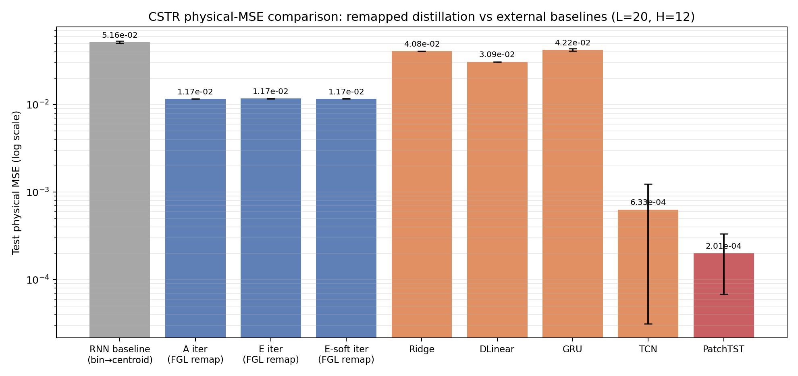
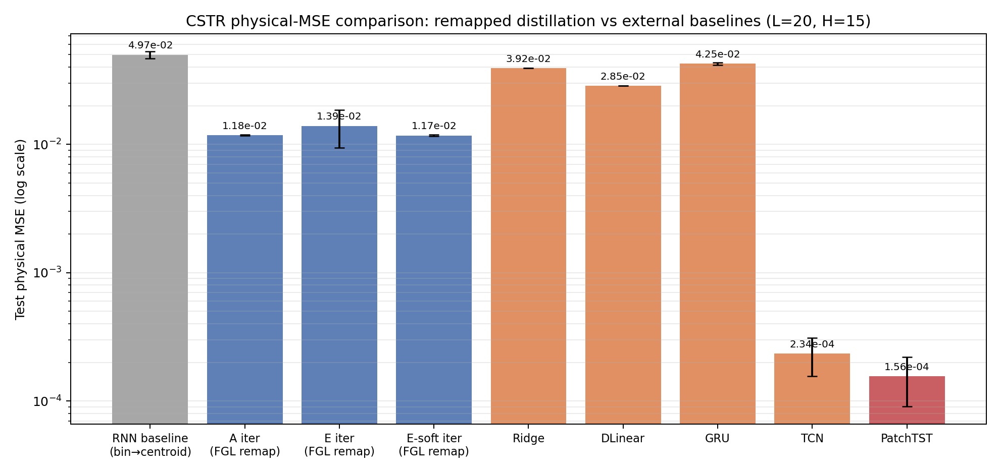

# CSTR 外部 Baseline 与 bin-index 重映射比较报告

> **2026-10-08 勘误**：本报告中的深度模型连续物理 MSE 存在反标准化二次平方错误；PatchTST/TCN 的外部优势被高估。修正说明和 PatchTST-FGL 对照见 `patchtst_fgl_report.md`。旧的 PatchTST `2.0e-4 / 1.6e-4` 数值不应继续引用。

**日期**:2026-09-18  
**分支**:`codex/cstr-external-baselines`  
**问题**:能否把历史 FGL / 连续自适应蒸馏的 bin-index 结果重映射回物理值 MSE,再与 DLinear、PatchTST 等时序预测方法公平比较?

## 1. 结论摘要

1. **可以做同口径比较。** 本次新增训练集质心重映射:预测 bin → 训练集中落入该 bin 的真实 `y` 均值;同时保留几何 bin-center 结果供审计。
2. **自适应迭代蒸馏确实优于它自己的 RNN 分类 baseline。** 以训练集质心物理 MSE 为准:
   - L20/H12:RNN baseline `5.16e-2`,最佳自适应臂约 `1.17e-2`,约降低 **77.4%**;
   - L20/H15:RNN baseline `4.97e-2`,最佳自适应臂约 `1.17e-2`,约降低 **76.4%**。
3. **但它没有超过强外部时序预测 baseline。** PatchTST 最强,TCN 次之:
   - H12:PatchTST `2.01e-4`,最佳自适应蒸馏约 `1.17e-2`;PatchTST 误差约为后者的 **1/58**;
   - H15:PatchTST `1.56e-4`,最佳自适应蒸馏约 `1.17e-2`;PatchTST 误差约为后者的 **1/75**。
4. **当前数据不支持“连续自适应蒸馏优于该领域主流时序预测方法”的主张。** 更稳妥的表述是:它改善了这个特定 RNN 分类蒸馏流程,但 PatchTST/TCN 在物理 MSE 上有数量级优势。
5. **E 臂的既有优势在物理 MSE 口径下不稳健。** H12 上 `E_iter` 略差于 `A_iter`;H15 上 `E_iter` 受一个高方差 seed 影响明显变差。`E_iter` 与 `A_iter` / `E_soft_iter` 的配对差异在 n=5 下均不显著。

## 2. 实验设置

- 数据:`cstr/data/data_h2o.pkl`
- 配置:`L=20`,`H∈{12,15}`,5 seeds
- 蒸馏:`epochs=30, round_epochs=15, K=5, α=0.5, T=4, bins=50`,变体 `E,E-soft`
- 外部 baseline:Ridge、DLinear、GRU、TCN、PatchTST;最多 50 epochs,早停 patience=10
- 主指标:测试集物理值 MSE
- 重映射:
  - **主口径 centroid**:类别 `k` → 训练集中真实目标落入 bin `k` 的均值;
  - **审计口径 bin-center**:类别 `k` → 该 bin 的几何中心;
  - 重映射只使用训练集目标,不使用测试集目标。

## 3. L20/H12 结果

| 方法 | 物理 test MSE | 说明 |
|---|---:|---|
| PatchTST | **2.0064e-4** | 最优 |
| TCN | 6.3265e-4 | 次优 |
| A iter / E-soft iter | 1.1672e-2 | 最佳蒸馏臂 |
| E iter | 1.1731e-2 | 与 A/E-soft 差异不显著 |
| DLinear | 3.0883e-2 | 劣于蒸馏臂 |
| Ridge | 4.0806e-2 | 劣于蒸馏臂 |
| GRU | 4.2237e-2 | 劣于蒸馏臂 |
| RNN baseline remap | 5.1595e-2 | 原流程 baseline |

PatchTST vs `E_iter`:Welch 检验 `p=6.09e-14`。  
TCN vs `E_iter`:Welch 检验 `p=1.32e-6`。

## 4. L20/H15 结果

| 方法 | 物理 test MSE | 说明 |
|---|---:|---|
| PatchTST | **1.5601e-4** | 最优 |
| TCN | 2.3377e-4 | 次优 |
| E-soft iter | 1.1736e-2 | 最佳蒸馏臂 |
| A iter | 1.1763e-2 | 与 E-soft 接近 |
| E iter | 1.3913e-2 | 方差大,含高误差 seed |
| DLinear | 2.8527e-2 | 劣于蒸馏臂 |
| Ridge | 3.9219e-2 | 劣于蒸馏臂 |
| GRU | 4.2506e-2 | 劣于蒸馏臂 |
| RNN baseline remap | 4.9683e-2 | 原流程 baseline |

PatchTST vs `E_iter`:Welch 检验 `p=2.49e-3`。  
TCN vs `E_iter`:Welch 检验 `p=2.54e-3`。

## 5. 图表

## 6. 对研究表述的影响

不能再写成:

> 连续自适应蒸馏优于其他时序预测方法。

应改为:

> 在 CSTR H₂O 数据上,连续自适应迭代蒸馏能大幅改善原 RNN 分类蒸馏 baseline 的物理值预测误差;但在与 Ridge、DLinear、GRU、TCN、PatchTST 等外部 baseline 的同物理值 MSE 比较中,PatchTST 与 TCN 具有数量级优势。因此 FGL/自适应蒸馏的优势应限定为“相对原始 FGL-RNN 流程的内部增益”,不能推广为超越主流时序预测方法。

另外,原报告中基于 bin-index MSE 的 E 臂优势,在当前物理 MSE 口径下未复现为显著优势;后续引用应注明评估口径。

## 7. 局限与下一步

1. **这是 post-hoc 重映射,不是连续输出重训练。** 蒸馏模型训练和早停仍沿用历史 bin-index 验证规则。下一步应实现真正的连续回归/响应蒸馏版本。
2. **输入表示不同。** FGL 历史流程使用离散化输入;外部 baseline 使用 train-only 标准化原始输入。方法级 baseline 比较是合理的,但如果要分离“输入离散化”的影响,需要给 FGL 增加连续输入版本。
3. **历史 bin 边界使用全序列 min/max。** 这是既有协议;重映射 decoder 虽然只用训练集,但严格去泄漏复算应把 bin edges 也改为 train-only。
4. **n=5 仍偏小。** 关键负结果建议扩到 10 seeds。
5. **应扩展到延迟混沌 CSTR 家族**,确认 PatchTST/TCN 的数量级优势是否在非周期/混沌工况下保持。

## 8. 产物

- 原始重映射结果:`cstr/results/cstr_iterative_continuous_remap.csv`
- 同口径汇总:`cstr/results/cstr_remap_vs_external_summary.csv`
- H12 图:`cstr/results/plots/cstr_remap_vs_external_L20_H12.png`
- H15 图:`cstr/results/plots/cstr_remap_vs_external_L20_H15.png`
