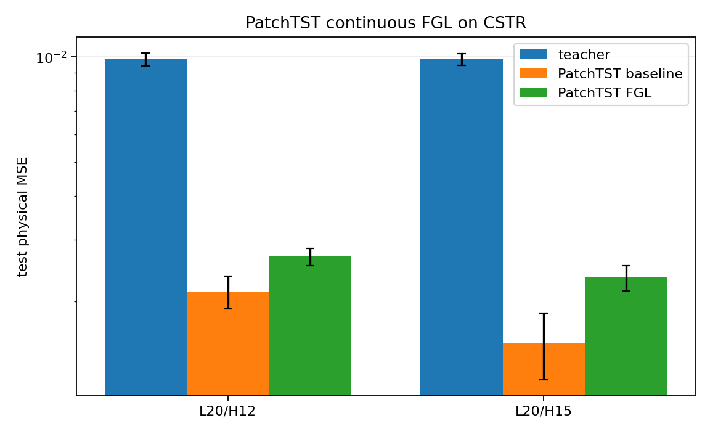

# PatchTST 连续 FGL 试点报告

**日期**：2026-10-08  
**数据**：`cstr/data/data_h2o.pkl`  
**运行设备**：GPU（`gpu` 服务器，RTX 4060 Laptop GPU）  
**入口**：`cstr/run.py -e patchtst_fgl`  
**产物**：`cstr/results/cstr_patchtst_fgl.csv`、`cstr/results/cstr_patchtst_fgl_summary.csv`

## 结论摘要

1. 已把 PatchTST 接入连续 teacher→baseline→student FGL 流程。
2. 任务与外部 baseline 同口径：direct horizon，输入 `L=20`，目标 `y[t+L+H-1]`；teacher 输入向后平移 `H-1` 步；train-only 标准化；报告物理值 MSE。
3. 在 `α=0.5`、5 seeds 下，PatchTST-FGL **没有缩小误差**，反而显著高于同骨干 PatchTST baseline。修复外部 baseline 反标准化平方误差后，这一结论仍成立。
4. 结果不支持“把 PatchTST 放入当前连续 MSE 蒸馏框架即可进一步改进”的假设。失败原因很可能是 teacher 本身误差约 `9.8e-3`，比 baseline 高约一个数量级，强蒸馏迫使学生靠近更差的 teacher 分布。

## 结果

| 配置 | Teacher MSE | PatchTST baseline | PatchTST FGL | FGL / baseline |
|---|---:|---:|---:|---:|
| L20 / H12 | 9.834e-3 ± 4.182e-4 | 2.132e-3 ± 2.301e-4 | 2.681e-3 ± 1.538e-4 | **1.258** |
| L20 / H15 | 9.838e-3 ± 3.631e-4 | 1.521e-3 ± 3.270e-4 | 2.335e-3 ± 1.936e-4 | **1.536** |

同批次重新校准后的 5-seed 外部 PatchTST baseline 为：

| 配置 | 修正后外部 PatchTST |
|---|---:|
| L20 / H12 | 1.983e-3 ± 2.125e-4 |
| L20 / H15 | 1.413e-3 ± 3.032e-4 |

配对 t 检验（baseline vs student）：

- H12：`t=-4.18`，`p=0.0140`
- H15：`t=-5.43`，`p=0.0056`

两个配置下 FGL student 都显著更差。

## 解读

当前 teacher 的目标是“向后平移窗口后的下一步”，但它输出的物理误差仍然很高。PatchTST baseline 已经比 teacher 好很多；此时 `α=0.5` 的强 MSE 蒸馏会引入负迁移。

因此结论应写成：

> 直接把 PatchTST 嵌入当前 FGL 强蒸馏流程不能缩小与外部 PatchTST 的差距；反而因 teacher 信息量不足而造成显著性能下降。

## 指标修正说明

检查外部 baseline 反标准化时发现：深度模型返回的 `val_mse_norm/test_mse_norm` 已经是 normalized MSE，但旧代码又把它们当作 normalized error 传入 `_physical_mse`，导致 `y_std²` 被二次平方。已修正为：

```python
val_mse = val_mse_norm * y_std ** 2
test_mse = test_mse_norm * y_std ** 2
```

并新增回归测试防止“MSE 被平方两次”。修正后的外部 PatchTST 数值见上表；旧的 `2.0e-4 / 1.6e-4` 不应继续使用。

## 下一步

1. 尝试弱蒸馏 `α∈{0.9,0.95,0.99}`，验证负迁移是否随蒸馏权重减弱而消失。
2. 改用响应分布/Gaussian 蒸馏，而不是直接对学生输出和 teacher 输出做 MSE。
3. 只在 teacher 优于 baseline 的样本或区域启用蒸馏。
4. 若目标是超越外部 PatchTST，应先构造比 PatchTST baseline 更强的 teacher，而不是复用当前“近视 teacher”。


