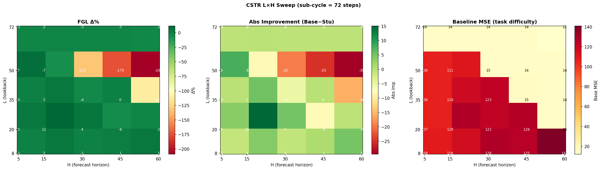
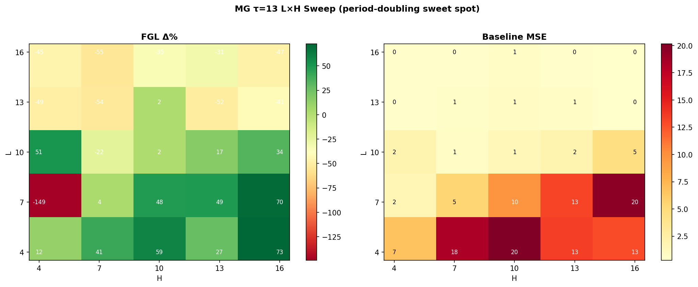
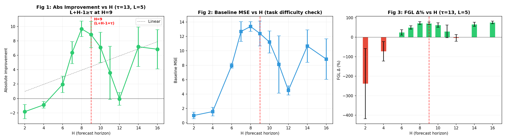
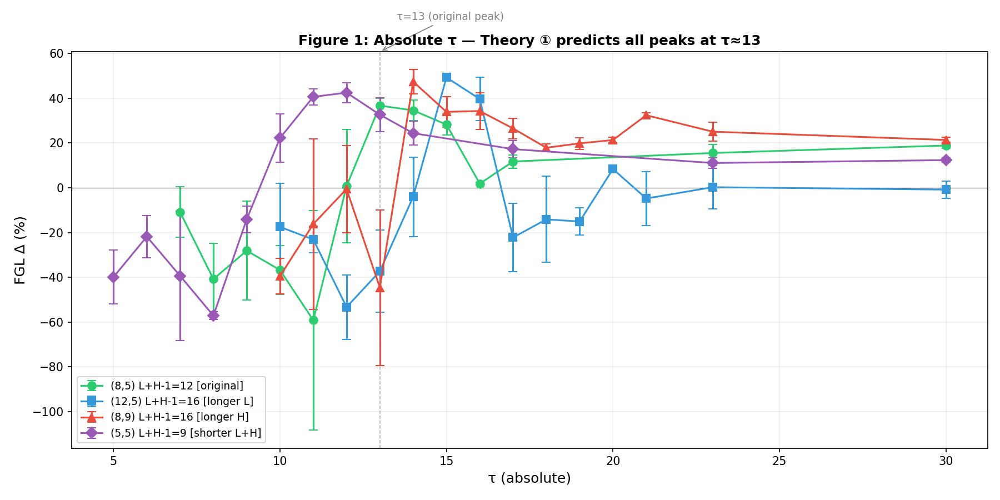
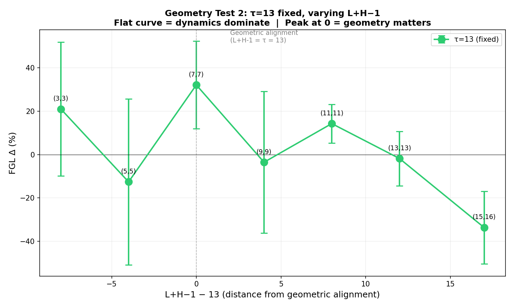
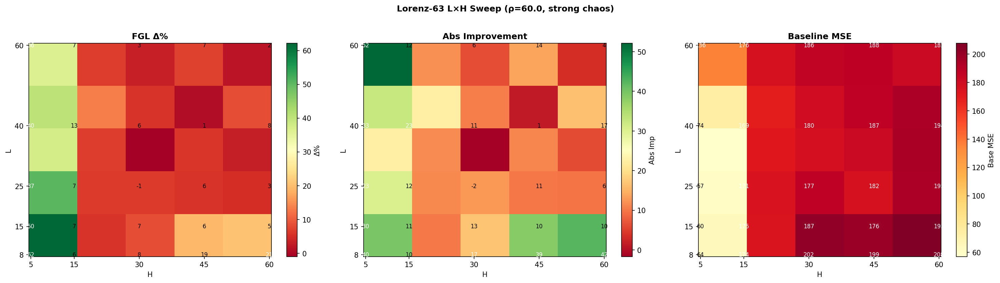
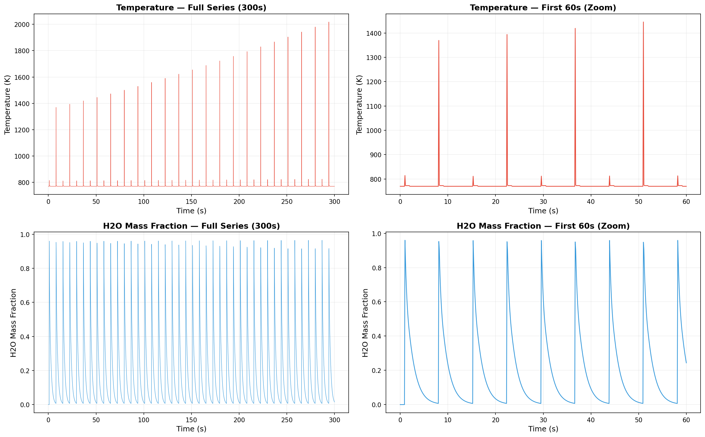
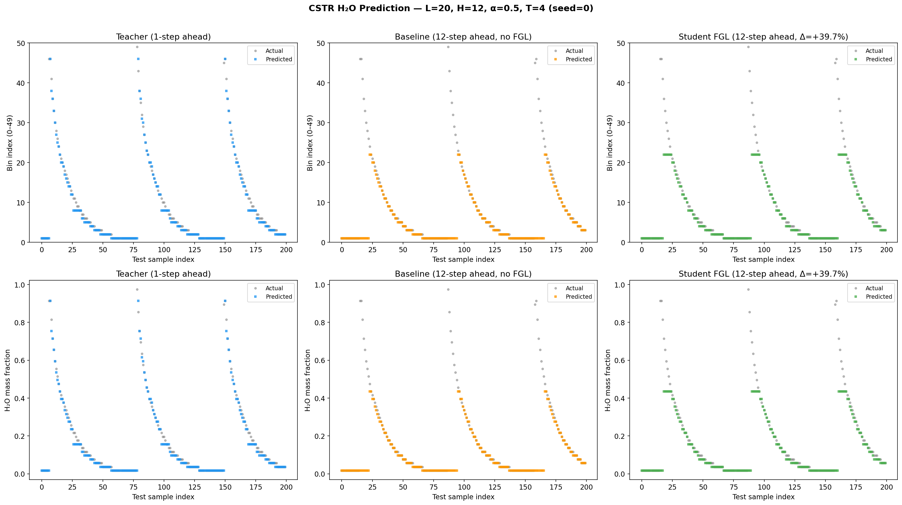

# Future-Guided Learning (FGL) 方法研究汇报

## 一、研究背景

本研究基于 *Nature Communications* 2025 年发表的 Future-Guided Learning（FGL）方法（Gunasekaran et al., 2025）展开。FGL 采用教师-学生（teacher-student）知识蒸馏架构来增强时间序列的远期预测能力，其核心机制可拆解为三步：

1. **教师模型**：在训练时被允许"窥见"近未来——它的输入窗口相对学生向前偏移 `offset = H−1` 步，因此只承担 1 步预测任务（预测 `t+1`），任务难度低、误差小；
2. **学生模型**：只能依据历史窗口 `L` 预测远未来 `t+H`（H 步预测），任务难度高；
3. **知识蒸馏**：训练损失为 `α·CE(student, label) + (1−α)·T²·KL(softmax(teacher/T) ‖ log_softmax(student/T))`，把教师在近未来上提取到的、学生无法从历史窗口直接获得的信息"搬运"给学生。

**研究目标**：在官方代码库的基础上新增 CSTR（化学连续搅拌釜式反应器）数据集，系统检验 FGL 方法对该数据集的适用性，并量化关键超参数（历史窗口 L、预测步长 H、蒸馏权重 α、温度 T）对 FGL 增益的影响；同时在 Mackey-Glass 与 Lorenz-63 两个对照系统上验证结论的普适性。

---

## 二、实验设置

### 2.1 数据集

- **CSTR 数据集**（本研究新增）：基于 Cantera 的 `h2o2.yaml` 化学反应机理，模拟化学计量比 H₂:O₂ = 2:1 的燃烧体系。仿真条件为初温 770 K、压力 8 kPa（60×133.3 Pa）、反应器体积 10×10⁻⁶ m³、进气流量 12 sccm，仿真时长 `t_end = 300 s`、步长 `dt = 0.1 s`，共生成 **3001 个时间点**。取 H₂O 质量分数作为预测目标（`data_h2o.pkl`），呈现平滑的锯齿状周期振荡，子振荡周期约 **72 步（实测约 7.15 s，名义 7.2 s）**，近周期 1 极限环（periodicity ≈ 0.95，Lyapunov ≈ 0）。
- **Mackey-Glass (MG) 数据集**：经典延迟微分方程 `dx/dt = β·x(t−τ)/(1+x(t−τ)ⁿ) − γ·x(t)`，参数 β=0.2, γ=0.1, n=10，由 `jitcdde` 求解生成 **10000 个时间点**。本实验主要使用 **τ=13**（倍周期分岔区，最大 Lyapunov 指数 ≈ +0.0009，处于混沌边缘）。
- **Lorenz-63 数据集**（对照组）：取 ρ=60 的强混沌参数（σ=10, β=8/3），观测 x(t) 分量，Lyapunov ≈ 1.6，生成 **8000 个时间点**。

### 2.2 模型与训练协议

- **网络结构**：教师与学生共享 2 层 RNN（带 dropout，FC-ReLU-FC 输出头），输入 `(batch, 1, L)`；部分对照实验替换为 2 层 LSTM（hidden=128）。
- **离散化**：将连续标量序列均匀离散为 **50 个 bin**，回归问题转为 50 类分类，以 MSE 反映离散误差。
- **默认超参数**：`epochs = 30`、`α = 0.5`、`T = 4`；每个 (L,H) 配置重复 3～5 个随机种子，报告均值（必要时附 ±标准差）。
- **超参数扫描范围**：L（历史窗口长度）、H（预测步长）、α ∈ {0, 0.1, 0.3, 0.5, 0.7, 0.9}、T ∈ {2, 4, 6, 8, 10, 12}。

### 2.3 FGL 的核心机制：时间偏移与信息不对称

理解后续所有现象的关键，在于教师-学生的**时间对齐窍门**。设预测目标为绝对时刻 `T = t+H` 的值：

```
时间轴 →        [t-L+1 ........ t]                 t+H=T
学生窗口:       |====== L ======|          (预测)  → 目标 T   offset=0,  horizon=H
教师窗口:                        |== L ==| (预测) → 目标 T   offset=H-1, horizon=1
                                 t+H-1
教师"独占"的近未来区间 = (t, t+H-1]，共 H-1 步 —— 这正是学生看不到、却能直接影响目标 T 的部分。
```

- **学生**：输入 `[t-L+1, t]`，预测 `t+H`，看不到 `(t, t+H]`；
- **教师**：输入窗口整体前移 `H−1` 步，即 `[t-L+H, t+H-1]`，只做 1 步预测得到 `t+H`。它"看到"了紧贴目标之前的 `H−1` 步近未来。

**信息不对称的来源**：教师凭 `offset=H−1` 获得了学生无法从历史窗口中提取的近未来信息。当这段近未来携带了"用历史无法推得"的新信息时（典型情形：联合窗口 `L+H−1` 小于系统内在的记忆/延迟尺度 τ），蒸馏有效；一旦 `L+H−1` 足够大、学生自己的历史已能覆盖系统的相关依赖，教师的"独占信息"便不再独占，蒸馏信号退化为噪声甚至误导——这是后文**阈值效应**与**地板效应**的共同根源。

---

## 三、CSTR 上的探索与发现

### 3.1 CSTR 上 FGL 有效的最佳配置

在以 L=20, H=15 为锚点的精细网格（L∈{15,18,20,22,25} × H∈{10,12,15,18,20}，每个配置 5 个种子）中，FGL 增益最大的配置为 **L=20, H=12**（默认 α=0.5, T=4）：

| 配置 | L | H | α | T | FGL Δ% | Baseline MSE | Student MSE |
|------|---|---|---|---|--------|--------------|-------------|
| 最佳配置 | 20 | 12 | 0.5 | 4 | **+25.7% ± 10.0%** | 129.1 ± 6.5 | 95.7 ± 12.3 |
| α-T 调优 | 20 | 15 | 0.1 | 12 | **+22.2% ± 11.2%** | 127.5 ± 7.1 | 98.4 ± 8.6 |

> 说明：FGL Δ% 为"逐种子相对提升 (baseline−student)/baseline 的均值"；Baseline/Student MSE 为对应种子均值 ± 标准差。L=20,H=12 用默认超参数即取得最佳；L=20,H=15 则需把温度调高、蒸馏权重调低（α=0.1, T=12）才能接近，但仍略逊。

**关键结论**：FGL 在 CSTR 上确可显著提升远期预测，最佳配置的 5 种子平均相对提升达 **+25.7%**。

### 3.2 决定性因素：L 与 H 主导 FGL 效果

通过对比两类扫描的影响幅度，可确认 **L（历史窗口）与 H（预测步长）是决定 FGL 是否有效的核心变量**，其影响远超 α 与 T：

- **证据 1 — L×H 联合扫描的巨大跨度**：在 CSTR 25 个 (L,H) 配置（L∈{8,20,35,50,72}, H∈{5,15,30,45,60}）中，FGL Δ% 从 **+11.6%（L=20,H=15）一直延伸到 −209.0%（L=50,H=60）**，跨度约 **220 个百分点**。Baseline MSE 与 FGL Δ% 的 Pearson 相关性达 **r = +0.713**（强正相关）——Baseline 越难，FGL 越可能正向。



**FGL Δ% 矩阵**（25 配置，每配置 3 种子均值；行为 L，列为 H）：

| L＼H | 5 | 15 | 30 | 45 | 60 |
|------|------|------|------|------|------|
| 8 | −0.9% | +3.3% | −0.7% | +0.7% | +3.2% |
| 20 | +3.4% | **+11.6%** | +4.1% | −6.4% | −2.5% |
| 35 | −0.0% | +3.5% | −4.3% | +0.0% | −110.8% |
| 50 | +7.3% | −7.3% | −131.7% | −174.7% | **−209.0%** |
| 72 | −2.6% | −1.8% | −2.6% | −2.5% | −3.5% |

**Baseline MSE 矩阵**（注意 L+H−1 足够大时骤降至 ≈14.1 地板）：

| L＼H | 5 | 15 | 30 | 45 | 60 |
|------|------|------|------|------|------|
| 8 | 108.3 | 116.0 | 127.7 | 125.4 | 140.9 |
| 20 | 106.6 | 127.5 | 122.3 | 126.5 | 14.8 |
| 35 | 106.5 | 117.8 | 122.9 | 15.1 | 14.2 |
| 50 | 106.5 | 110.8 | 14.8 | 14.2 | 14.1 |
| 72 | 14.1 | 14.1 | 14.1 | 14.1 | 12.0 |

- **证据 2 — α×T 仅在固定 (L,H) 内做小幅微调**：在已选定的 L=20,H=15 上做 α×T 网格搜索（6×6=36 组），组间 FGL Δ% 的变化仅约 **10～15 个百分点**。

**结论**：L 与 H 决定 FGL 落在"有效区"还是"失效区"；α 与 temperature 只在已选定的有效区内做精调。

### 3.3 Baseline 地板效应与 FGL 失效

CSTR 上存在一个关键现象：**当 L+H−1 足够大时，Baseline 的 MSE 会骤降至一个约 14.1 的"地板"，同时 FGL 转为负向甚至灾难性负向**。

| 区域 | L | H | L+H−1 | Baseline MSE | FGL Δ% | 现象 |
|------|---|---|-------|--------------|--------|------|
| 困难区 | 20 | 12 | 31 | 129.1 | +25.7% | Baseline 难，FGL 正向 |
| 地板区 | 50 | 30 | 79 | 14.8 | −197.3% | Baseline 易，FGL 灾难性负向 |
| 地板区 | 72 | 5 | 76 | 14.1 | −1.9% | Baseline 易，FGL 轻微负向 |

**地板值 ≈ 14.1**：来源于 50-bin 离散化噪声——当周期信号几乎可被完美预测时，剩余误差即为量化噪声下限。

**机制解释**：当 L+H−1 足够大，Baseline 已能仅凭历史窗口近乎完美地外推目标；此时教师反而成为误导——教师预测的是 `t+1`，而学生需要预测的是 `t+H`，二者目标错位，KL 蒸馏把学生拉向错误方向，故 FGL 转负。

### 3.4 优化方向的综合对比：什么决定 CSTR 上 FGL 的成败

为使不同优化方向可比，本节将所有方向的对比**统一在有效锚点 L=20, H=15（RNN、α=0.5、T=4）下**，其基准 FGL Δ = **+14.1% ± 10.4%**（5 种子）。

> 说明：此处 +14.1% 为 5 种子结果；§3.2 L×H 扫描矩阵中 L=20,H=15 显示的 +11.6% 为该扫描的 3 种子结果，二者差异源于种子集不同与本配置的高方差（±10%），属同一口径下的统计涨落。

#### 3.4.1 统一锚点口径下的优化方向对比（L=20,H=15，基准 +14.1%）

| 优化方向 | 最优配置 | FGL Δ% | 相对基准 | 判定 |
|---------|---------|:---:|:---:|:---:|
| 基准 | L=20,H=15, α=0.5,T=4, RNN | +14.1% ± 10.4% | — | — |
| L,H 精细搜索 | **L=20, H=12** | **+25.7% ± 10.0%** | +11.6pp | ✓ 有效 |
| α×T 网格 | α=0.1, T=12 | +22.2% ± 11.2% | +8.1pp | ✓ 有效 |
| 自适应蒸馏 | 差值加权（变体 C）·**修正前** | +18.8% ± 6.7% | +4.7pp（p=0.42） | 未显著（见 §3.4.3 更新） |
| LSTM 架构 | LSTM 替换 RNN | +13.0% ± 17.5% | −1.1pp（p=0.89） | ✗ 无效 |
| 回归模式 | 连续值预测 | +4.0% ± 12.1% | −10.1pp | ✗ 远差于分类 |

**解读**：在已选定的有效 (L,H) 区内，**动 L,H 本身（+11.6pp）和 α×T（+8.1pp）带来实质增益**；换架构（LSTM）、换任务形式（回归）均无效。自适应蒸馏在**早期实现**下未达显著（见上表），但**修正实现后（变体 E，见 §3.4.3 更新）在 CSTR 上显著且网格级有效**——故"蒸馏策略本身难以突破天花板"需限定为"温和加权下成立"，不应泛化。

#### 3.4.2 早期七方向排除扫描（默认 L=8 口径，作为发现 L,H 的前置阶段）

上述统一对比得以成立，源于一段试错过程。在发现 L,H 的决定性作用之前，我们曾围绕**默认配置 L=8** 系统排查"是否是实现层面的问题"，沿 7 个方向逐一尝试。注意：**这一阶段口径为 L=8 死区，与 §3.4.1 的锚点口径不同**，单列于此仅为还原发现路径：

| # | 方向 | 操作简述 | 最佳 Δ% | 排除的假设 |
|---|------|---------|:---:|------|
| 1 | α×T 网格 + H 窄扫描 | α×T 共 36 组；H∈[3,9] | +0.4% | 超参数不合适 |
| 2 | 改用温度数据 | `data.pkl`（770~2000K），L=3 | 0.0% | 数据类型问题（模型坍塌为常数） |
| 3 | 缩短 lookback | L=3、4；H∈[3,9] | −0.1% | 信息不对称不够 |
| 4 | 回归模式 | 跳过离散化，连续值预测 | −2.3% | 离散化损失信息 |
| 5 | LSTM 替换 RNN | 2 层 LSTM（hidden=128） | +0.3% | 模型容量不足 |
| 6 | Seq2Seq 周期预测 | Teacher 预测前 K 步，Student 预测全 72 步 | −6.3% | 任务难度差不够 |
| 7 | 参数扫描 + 外部驱动 | 21 组反应器参数；正弦扰动进气 | ~0% | 周期性本身是根因 |

七个方向的全部结果集中在 0% 附近，最高仅 +0.4%。

**关键盲点**：它们要么固定 L=8、要么只把 L 缩到 3-4、把 H 在 [3,9] 内窄扫，**从未做过跨越式的系统 L×H 联合扫描**，恰好错过 L≈20、H≈12 有效区。

**两个口径的对照恰好点明要害**：同一优化方向换口径后效果天差地别——α×T 从 L=8 下的 +0.4% 跃升至 L=20,H=15 下的 +22.2%；回归模式从 −2.3% 变为相对基准 −10.1pp。这反向印证：**真正决定 CSTR 上 FGL 成败的是 L,H 口径本身**，前 7 个方向"改什么都不管用"正因它们改的全是 L,H 之外的非决定性变量。

#### 3.4.3 自适应蒸馏：逐样本加权能否突破天花板？

> **更新（2026-07-24）—— 本节为修正前实现，核心结论已被推翻**。下文记录的 A/B/C/D 消融用的是 `max(0, CE_baseline − CE_teacher)` 标准、[0.2, 2.0] 温和归一化，且 teacher/student 逐样本误差存在**索引错位**（teacher loader 因 `offset=H−1` 使约 91% 的比较落在错误目标上）。这三点共同导致"方向正确但未显著（p=0.42）"。修正为 **teacher−student 逐样本 MSE 差距**（索引按 `j−(H−1)` 对齐）+ **零地板放大变体 E**（归一化 [0,4]；student 已做对的点蒸馏权重=0，预算全集中在弱点）后：
> - **L=20,H=15（n=5）**：E 相对 uniform 对照 A，Δinit=+33.2%（配对 p≈0.018），vs baseline +46.1%。温和变体 C 即使修正仍仅 +10.6%（噪声边缘）——**显著化主要来自放大版 E**。
> - **5×5 L×H 网格（2 seeds）**：**47/50** 个 cell×seed 上 E<A（94%），平均 student MSE 降约 30%（cell 聚合 30.4%、配对聚合 29.5%），**网格级配对 t=−8.16（df=49，p≪0.001）**——"E 一致优于 A"在整个网格上整体显著，非锚点处偶然；增益集中在标准 student 仍弱的中部（+25~67%），L=72 行（A 已逼近地板 MSE≈14）仅 +1~9%。
> - 变体 D（权重作用在 α 上）灾难性劣化在新实现下**依然成立**（−23.4% vs init），与旧结论一致。
> - 数据/复跑：`cstr/results/adaptive_lh_sweep.csv`、`uv run python cstr/run.py -e adaptive_weight --variants E`、`uv run python cstr/run.py -e adaptive_grid`(网格版,原 `sweep_adaptive.py`)。**仅 CSTR 验证，MG/Lorenz 待移植。**
>
> 下文旧文本保留以记录探索路径，其统计结论请以本更新为准。

§3.4.1 中"自适应蒸馏"一行值得展开。诊断显示 CSTR 的误差集中在少数样本上，且 Teacher 在这些样本上远优于 Baseline；标准 FGL 对所有样本一视同仁，未能利用这一优势。为此设计**逐样本蒸馏权重** `w_i ∝ max(0, CE_baseline,i − CE_teacher,i)`（Teacher 有优势则蒸馏强、Teacher 也错则不蒸馏），归一化到 [0.2, 2.0]，并在 L=20,H=15 上做四变体消融（各 5 种子；变体 A 即 §3.4.1 的基准）：

| 变体 | 权重方案 | Student MSE | Δ% |
|------|---------|:---:|:---:|
| A | 标准 FGL（无加权，对照＝基准） | 110.5 | +14.1% ± 10.4% |
| B | KL 项 × CE_baseline | 108.0 | +16.2% ± 7.6% |
| **C** | **KL 项 × max(0, CE_b − CE_t)**（差值加权） | **104.9** | **+18.8% ± 6.7%** |
| D | 权重作用于 α（逐样本调节 CE/KL 平衡） | 136.0 | −5.6% ± 9.8% |

均值呈 C > B > A 的正确趋势，最优变体 C 较对照 A 提升 +4.7pp、且方差更低（±6.7% vs ±10.4%），有一定稳定化作用；但 Welch t 检验 **C vs A: p = 0.42（不显著，Cohen's d = 0.54，中等效应但 n=5 不足）**。变体 D（权重作用于 α）则灾难性劣化（D vs C: p = 0.0024）——逐样本扰动 α 会破坏 batch 内损失结构。

**结论**：自适应蒸馏在方向上正确、能稳定方差，但**未取得统计意义上的显著进展**；CSTR 上 FGL 的天花板最终仍由 L、H 与系统动力学共同决定，难以靠蒸馏策略本身突破。**〔此为修正前实现结论，已被本节 2026-07-24 更新推翻：修正 + 变体 E 后在 CSTR 显著且网格级有效。〕**

---

## 四、Mackey-Glass 数据集的深入分析

### 4.1 τ 扫描：为何选择 τ=13

为判定 τ=13 是否为偶然，我们在固定 L=8、H=5 下扫描 τ∈{10,13,17,23,30}（覆盖从近周期到强混沌的动力学）：

| τ | Lyapunov | Periodicity | Baseline MSE | FGL Δ% |
|:---:|:---:|:---:|:---:|:---:|
| 10 | +0.0009 | 0.9964 | 0.37 | +5.2% |
| **13** | **+0.0009** | **0.9934** | **3.38** | **+74.9%** ★ |
| 17 | +0.0059 | 0.8168 | 12.48 | +5.1% |
| 23 | +0.0096 | 0.4019 | 11.84 | +9.5% |
| 30 | +0.0096 | 0.4090 | 11.78 | +5.4% |

**关键观察**：FGL 增益在 **τ=13 处出现孤峰（+74.9%）**，而进入强混沌的 τ=17/23/30 反而回落到 +5~9%。相关性分析进一步表明：FGL Δ% 与 Lyapunov 几乎无关（r = −0.121）、与 Periodicity 无关（r = −0.086），而与 **Baseline MSE 中等正相关（r = +0.451）**——即"任务越难、FGL 越有利"。这把 FGL 的"甜品区"定位在**倍周期分岔区（τ=13）而非混沌区**，也为后续几何检验（§4.5）埋下伏笔。

### 4.2 MG τ=13 上的 L×H 联合扫描



**FGL Δ% 矩阵**（25 配置，每配置 3 种子均值；行为 L，列为 H）：

| L＼H | 4 | 7 | 10 | 13 | 16 |
|------|------|------|------|------|------|
| 4 | +11.5% | +40.9% | +59.1% | +27.5% | **+72.6%** |
| 7 | −149.2% | +4.0% | +48.0% | +48.9% | +70.2% |
| 10 | +50.9% | −22.3% | +2.1% | +17.0% | +33.5% |
| 13 | −49.0% | −54.4% | +1.6% | −51.6% | −40.7% |
| 16 | −45.4% | −55.1% | −34.6% | −31.1% | −47.1% |

**Baseline MSE 矩阵**（L≥13 时已降至 <1.0，但无离散化地板）：

| L＼H | 4 | 7 | 10 | 13 | 16 |
|------|------|------|------|------|------|
| 4 | 6.59 | 18.29 | 20.15 | 13.41 | 12.80 |
| 7 | 1.57 | 5.40 | 9.74 | 13.10 | 19.58 |
| 10 | 1.86 | 0.69 | 1.38 | 1.90 | 4.55 |
| 13 | 0.46 | 0.56 | 0.87 | 0.66 | 0.35 |
| 16 | 0.37 | 0.48 | 0.61 | 0.41 | 0.29 |

**关键观察**：
- 25 个配置中 FGL 增益最大达 **+72.6%（L=4,H=16）**；纳入独立的 L-扫描后整体最佳为 **+78.5%（L=9,H=5）**——显著强于 CSTR 的 +25.7%。
- 正向配置占比 **60%（15/25）**，远高于 CSTR 的 24%。
- 与 CSTR 不同，MG 不存在离散化地板：L≥13 时 Baseline MSE 降至 <1.0 是系统可预测性本身所致。

### 4.3 L 扫描（固定 H=5）：台阶式骤降与阈值效应

固定 τ=13、H=5、α=0.5，扫描 L（每值 3 种子）：

| L | L+H−1 | Baseline MSE | FGL Δ% | 现象 |
|---|-------|--------------|--------|------|
| 5 | 9 | 8.260 | +32.8% | FGL 正向 |
| 7 | 11 | 8.221 | +37.7% | FGL 正向 |
| 9 | 13 | 5.902 | **+78.5%** | ★ 峰值（恰处 L+H−1=τ） |
| **10** | 14 | 0.692 | **−15.7%** | ← 骤降！符号反转 |
| 11 | 15 | 0.537 | −38.6% | FGL 有害 |
| 12 | 16 | 0.495 | −37.0% | FGL 有害 |

**台阶式骤降**：从 L=9 到 L=10，两个量同时剧变——Baseline MSE：5.902 → 0.692（下降 **8.5 倍**）；FGL Δ%：+78.5% → −15.7%（**符号反转**）。

**阈值公式**：教师信息优势消失的临界条件为

$$L + (H-1) > \tau$$

代入 H=5、τ=13，临界点位于 L+H−1=13，即 **L=9 与 L=10 之间**。实测中 L=9（L+H−1=13=τ）仍是峰值（+78.5%），一旦 L+H−1 超过 τ（L≥10）FGL 立即转负——与公式预测的过渡位置精确吻合。L 与 Baseline MSE（r = −0.726）、L 与 FGL Δ%（r = −0.824）均呈强负相关。

### 4.4 H 扫描（固定 L=5）：U 型恢复与双效应竞争

固定 τ=13、L=5，扫描 H（每值 5 种子）：



| H | L+H−1 | Baseline MSE | FGL Δ% | 现象 |
|---|-------|--------------|--------|------|
| 2 | 6 | 1.029 | −238.2% | FGL 有害 |
| 6 | 10 | 7.930 | +24.5% | FGL 转正 |
| 8 | 12 | 13.381 | +72.2% | 峰值 |
| **9** | **13** | 12.401 | +71.1% | 临界点（L+H−1=τ） |
| 12 | 16 | 4.506 | −3.7% | 接近零 |
| 14 | 18 | 10.668 | +65.7% | 恢复正向 |
| 16 | 20 | 8.856 | +75.3% | 再次达峰 |

**H 扫描的复杂性**：与 L 扫描的单调台阶骤降不同，H 扫描呈"先升—回落—再升"的 **U 型恢复**。原因是 H 同时驱动两个相互竞争的效应：(1) **任务难度效应**——H 越大，学生的 H 步预测越难，越需要教师辅助，利好 FGL；(2) **信息窗口效应**——H 越大则 L+H−1 越大，教师"独占信息"越少，削弱 FGL。两效应此消彼长导致非单调。统计上，H<9 与 H≥9 两组差异显著（Welch t-test: **p = 0.035**）。这也说明 **L+H−1≥τ 的阈值公式仅在固定 H 扫描 L 时严格成立，不能自由推广到 H 扫描**。

### 4.5 几何对齐检验：排除"纯几何共振"假说

为区分两种竞争假说——"FGL 甜品区由动力学分岔引起" vs "由超参数几何 L+H−1≈τ 引起"——我们固定 τ=13，在大幅改变 L+H−1（从 9 到 16）的多个配置下扫描 τ，观察 FGL 峰值位置 τ_peak 是否随几何对齐而移动。




**关键发现**：
- 四个配置的 τ_peak 始终落在 **τ∈[12, 15]**（跨度仅 3），并不随 L+H−1 的大幅变化而显著移动；
- 第二轮几何检验中，"对齐组"(L+H−1=13) 的 FGL Δ (+32.1%) 与"偏离组"的误差棒明显重叠，对齐优势 <2×。

**结论**：排除了"纯几何共振"解释——FGL 效果与系统内在动力学特性密切相关，而非仅仅由超参数几何配置决定。

### 4.6 MG 规律小结

1. **L、H 的决定性作用**：与 CSTR 一致，(L,H) 配置是 MG 上 FGL 效果的决定因素。
2. **阈值公式**：`L+(H−1) > τ` 是教师信息优势消失的条件，在固定 H 扫描 L 时严格成立。
3. **动力学的影响**：FGL 增益与数据集动力学密切相关——MG τ=13（倍周期分岔）的最大 Δ（+78.5%）远高于 CSTR（+25.7%）。
4. **Teacher-Student 信息不对称**：当 L+H−1 < τ 时，教师凭借 `offset=H−1` 的时间偏移，能"看到"学生无法仅凭历史窗口 L 获得的信息，这是 FGL 有效的直接机制。

---

## 五、Lorenz-63：强混沌下的稳健正例

### 5.1 L×H 联合扫描



**FGL Δ% 矩阵**（25 配置，每配置 3 种子均值；L∈{8,15,25,40,60}, H∈{5,15,30,45,60}）：

| L＼H | 5 | 15 | 30 | 45 | 60 |
|------|------|------|------|------|------|
| 8 | **+62.2%** | +5.8% | +8.4% | +19.3% | +20.5% |
| 15 | +50.4% | +6.5% | +6.6% | +5.7% | +4.9% |
| 25 | +37.4% | +6.8% | −1.0% | +6.0% | +3.1% |
| 40 | +40.3% | +13.4% | +5.7% | +0.8% | +8.5% |
| 60 | +36.1% | +6.8% | +3.4% | +7.2% | +1.8% |

**Baseline MSE 矩阵**（不存在离散化地板，混沌系统本质上不可长期预测）：

| L＼H | 5 | 15 | 30 | 45 | 60 |
|------|------|------|------|------|------|
| 8 | 63.5 | 173.9 | 202.0 | 198.9 | 207.7 |
| 15 | 59.9 | 175.2 | 187.1 | 176.4 | 193.4 |
| 25 | 57.0 | 171.4 | 177.4 | 182.0 | 194.6 |
| 40 | 74.1 | 169.0 | 179.8 | 187.1 | 193.5 |
| 60 | 135.8 | 176.1 | 185.9 | 188.1 | 182.3 |

### 5.2 稳健正例的特征

Lorenz 与 CSTR 形成鲜明对照，体现出强混沌系统对 FGL 的"天然友好"：

- **几乎全配置正向**：25 个配置中 **24 个正向（96%）**，仅 L=25,H=30 一个为 −1.0%。
- **最大 Δ = +62.2%（L=8,H=5）**，且**无需精调**——默认超参数即奏效，与 CSTR 必须精扫 L,H 才能挤进有效区截然不同。
- **H=5 列全部强正向**（+36.1% ~ +62.2%，列均值 **+45.3%**）：短预测步长下教师信息优势最大。
- **无地板效应**：混沌发散使 Baseline 永远难以完美预测，蒸馏信号始终有用；H 与 FGL Δ% 呈中等负相关（r = −0.523，H=5 为特例）。

**机制直觉**：强混沌系统中，轨迹对初始条件敏感、持续发散，教师的近未来"独占信息"几乎永远含有学生无法从历史推得的新内容——因此信息不对称始终存在，FGL 稳健正向，无关 L 多大、H 多长。

---

## 六、三系统综合对比与图证

### 6.1 CSTR 数据特性



H₂O 质量分数呈现平滑的锯齿状周期振荡，周期约 72 步（7.15 s），periodicity ≈ 0.95（近周期 1 极限环）。

### 6.2 最佳配置预测结果

在最佳配置 L=20, H=12 下，学生模型的预测曲线：



### 6.3 三系统综合对比

我们在三个动力学特性迥异的系统上各做了 25 配置的 L×H 联合扫描。为公平对比，下表"最大 FGL Δ"一栏同时给出 **同一 L×H 扫描内的最大值**（apples-to-apples）与 **跨所有实验的整体最佳**：

| 系统 | 动力学特性 | Lyapunov | 正向配置比例 | L×H 扫描最大 Δ | 整体最佳 Δ |
|------|-----------|----------|-------------|---------------|-----------|
| CSTR (H₂O) | 周期 1 极限环 | ≈ 0 | 24% (6/25) | +11.6% (L=20,H=15) | **+25.7%** (L=20,H=12，精细网格) |
| Mackey-Glass (τ=13) | 倍周期分岔 | ≈ +0.001 | 60% (15/25) | +72.6% (L=4,H=16) | **+78.5%** (L=9,H=5，L 扫描) |
| Lorenz-63 (ρ=60) | 强混沌 | ≈ 1.6 | 96% (24/25) | +62.2% (L=8,H=5) | **+62.2%** (L=8,H=5) |

> 注：CSTR 的 +25.7% 来自更精细的 anchor 网格而非 25 配置 L×H 扫描，因此与 MG/Lorenz 的 L×H 扫描最大值并非严格同口径；若要求同口径，CSTR 在 L×H 扫描内的最大值仅为 +11.6%。

**关于"反馈环数量"与"倍周期分岔"假说的说明**：曾有假说认为可用"反馈环数量（CSTR=1, MG=2, Lorenz=∞）"或"倍周期分岔"解释三系统 FGL 效果的差异。我们建议**将其视为探索性假说而非确定性结论**，理由是：(1) 缺乏严格的因果干预实验；(2) 其他解释（如可预测性差异、Teacher-Student 信息不对称程度）同样自洽——三系统的 Baseline MSE ↔ FGL Δ% 均呈正相关即是一致证据；(3) 需在更多系统上验证。

---

## 七、结论与展望

### 7.1 主要结论

1. ✅ **FGL 在三个数据集上均有效，但强度与稳健性差异悬殊**
   - CSTR：L=20,H=12，5 种子平均 +25.7%（精细网格最佳，但 L×H 扫描内仅 +11.6%，需精扫才能找到）。
   - MG τ=13：L=9,H=5，3 种子平均 +78.5%（强度最高）。
   - Lorenz ρ=60：L=8,H=5，+62.2%（96% 配置正向，最稳健）。

2. ✅ **L 与 H 是核心因素**
   - 三个数据集上，(L,H) 配置均对 FGL 起决定作用（CSTR 跨度达 220pp）。
   - α 与 temperature 仅起精调作用（同 (L,H) 内约 10～15pp）。CSTR 早期七方向优化之所以全部失败，正因它们改的全是 L,H 之外的非决定性变量。

3. ✅ **阈值效应（MG）**
   - 严格验证了阈值条件 `L+(H−1) > τ`：当联合信息窗口超过 τ，教师信息优势消失，FGL 失效（固定 H 扫 L 时成立）。

4. ✅ **Baseline 地板效应（CSTR）**
   - 当 Baseline 过易（MSE 降至 ≈14.1 的离散化噪声地板），FGL 失效甚至有害；地板由系统内在可预测性与离散化量化噪声共同决定。

5. ✅ **动力学特性影响**
   - FGL 增益与数据集动力学密切相关：周期系统（CSTR）天花板低且需精调；倍周期分岔（MG τ=13）强度最高；强混沌（Lorenz）最稳健、不需精调。

6. ⚠️ **蒸馏策略的优化空间（口径已修正）**
   - α×T 调参有效（相对 +14.1% 基准 +8.1pp）。自适应逐样本蒸馏在**早期实现**下未达显著（p=0.42），但该实现存在标准错用（baseline-CE 差）+ 索引错位 + 温和加权三重缺陷；**修正后变体 E 在 CSTR 显著（p≈0.018）且网格级有效**（47/50 cell×seed，详见 §3.4.3 更新）。"FGL 天花板由 L、H 与动力学决定"应限定为"温和加权下成立"。

### 7.2 局限性

1. **系统覆盖有限**：仅 3 个系统、1 种主干架构（2 层 RNN，部分 LSTM 对照），结论的普适性需在更多动力学系统与架构上检验。
2. **种子方差偏高**：部分配置的 FGL Δ% 变异系数 >1（如 MG H=2、CSTR 地板区），单看均值可能高估稳定性；关键结论应配合 ±std 或显著性检验解读。
3. **阈值公式的适用边界**：`L+(H−1) > τ` 仅在固定 H 扫描 L 时严格成立；H 扫描因耦合了 Teacher offset 的变化，呈现非单调的 U 型，不能简单套用该公式。
4. **"反馈环数量"假说为相关性而非因果**：当前证据（三系统 Δ 排序与反馈环数量一致）只能说明二者相关，未经因果干预证实，宜作为待检验假说。
5. **自适应蒸馏（已修正）**：早期"n=5、d=0.54、未显著"是缺陷实现的产物（见 §3.4.3 更新）；修正后变体 E 在 CSTR 显著且网格级有效，但**仅 CSTR 验证、MG/Lorenz 待移植**，且 W_MAX/地板未调参。

### 7.3 未来工作建议

1. 量化 Teacher-Student 信息不对称的指标（如互信息差、条件熵差），使其可计算、可比较。
2. 改进教师目标与学生目标的对齐方式，削弱 H 对教师 offset 的耦合，缓解大 H 下的目标错位。
3. 在更多化学动力学系统与经典混沌系统（如 Rössler、Duffing）上检验结论普适性。
4. ~~研究自适应蒸馏策略，并在更大种子数下复核其是否真能突破当前天花板。~~ **(2026-07-24 部分完成)**：修正实现后变体 E 在 CSTR 已突破；待办：移植 MG/Lorenz 验证普适性、调 W_MAX/地板。
5. 根据 (L,H,τ) 配置自动调整 α 与 temperature 的自适应调度策略。

---

## 附录：详细实验数据索引

### CSTR
- CSTR L×H 扫描（25 配置×3 种子）：`cstr/results/cstr_lh_sweep.csv`
- CSTR 精细网格（L=15~25 × H=10~20，5 种子）：`cstr/results/anchor_refine_results.csv`
- CSTR α-T 网格（L=20,H=15，6×6×3 种子）：`cstr/results/anchor_alpha_T_results.csv`
- CSTR 自适应蒸馏消融（4 变体×5 种子，**修正前实现**）：`cstr/results/adaptive_weight_results.csv`
- CSTR 自适应 E vs A 的 L×H 网格（修正实现，2 种子）：`cstr/results/adaptive_lh_sweep.csv` + 热力图 `cstr/results/plots/adaptive_lh_E_vs_A.png`

### Mackey-Glass
- MG τ 扫描：`conclusion/data_1_mg_tau_sweep.md`
- MG L×H 扫描：`mackey_glass/results/mg_lh_sweep.csv`
- MG L 扫描（阈值检验，H=5）：`mackey_glass/results/threshold_quick_results.csv`
- MG H 扫描（阈值检验，L=5）：`mackey_glass/results/h_threshold_results.csv`
- MG 几何检验：`mackey_glass/results/`（`geometry_test_results.csv`、`geometry_test2_results.csv`）

### Lorenz-63
- Lorenz L×H 扫描：`lorenz/results/lorenz_lh_sweep.csv`

### 全部实验汇总
- 跨九类实验的原始数据与统计：`conclusion/data.md`
- CSTR 最优配置与各优化方向详细报告：`conclusion/best_sample_cstr.md`
